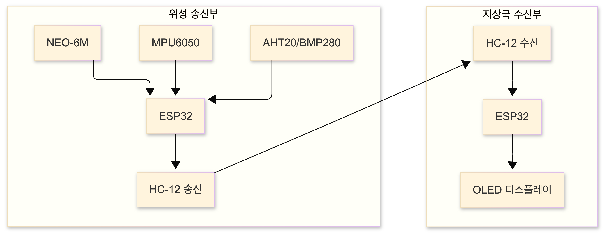

# 프로젝트 소개

이 프로젝트는 음료수 캔 크기의 위성 모형(CanSat)을 제작하여, 낙하 과정에서 수집한 다양한 센서 데이터를 지상국으로 실시간 전송하는 원거리 통신(Telemetry) 시스템을 구현하는 것을 목표로 합니다.

::github{repo="KKK12142/CANSAT_project"}

:::note
이 포스트는 [ESP32]() 및 각 센서들의 활용방법 학습을 위해 작성되었습니다.
:::

# 시스템 전체 구성

완성된 캔위성 시스템은 아래와 같이 **위성 송신부(Satellite)** 와 **지상국 수신부(Ground Station)** 로 구성됩니다. 파란색 박스는 데이터를 수집하여 송신하는 위성부이며, 빨간색 박스는 데이터를 수신하여 시각화하는 지상국입니다.

## 데이터 흐름도

**[위성 송신부]** GPS, IMU(가속도/자이로), 환경 센서(온습도/기압)가 ESP32로 데이터를 보내고, ESP32가 이를 취합하여 HC-12 무선 모듈을 통해 송신함.
**[지상국 수신부]** 433MHz RF 신호를 수신한 HC-12 모듈이 ESP32로 데이터를 전달하고, 최종적으로 OLED 디스플레이에 정보를 시각화함.

# 프로젝트 로드맵
각 단계별 상세 포스트를 통해 시스템을 구현해 나가겠습니다. (`링크`를 클릭하여 해당 포스트로 이동하세요.)

## [개발환경 및 기본셋팅](/posts/embedded-system/2_setup_arduino_ide/)
 - Arduino IDE 설치
 - 필요 라이브러리 설치
 - ESP32 연결

## 위성 송신부
 - [NEOPIXEL RGB LED](/posts/embedded-system/3_neopixel/) 상태 표시등 구현
 - [MPU6050](/posts/embedded-system/5_mpu6050/) 6축 자이로/가속도 센서를 이용한 자세 측정
 - [AHT20+BMP280](/posts/embedded-system/4_aht20_bmp280/) 온도, 습도, 기압 및 고도 측정
 - [NEO-6M-0-001(GPS)](/posts/embedded-system/6_gps/) 위도, 경도 좌표 수집
 - [HC-12모듈](/posts/embedded-system/7_hc-12/) 장거리 무선데이터 송신
 
## 지상국 수신부
 - [HC-12모듈](/posts/embedded-system/7_hc-12/) 데이터 수신 및 파싱
 - [OLED 모듈](/posts/embedded-system/8_oled/) 수신 데이터 시각화 및 UI 구현

:::caution[발생했던 이슈]
- UART 자원 충돌: ESP32의 3개 UART 포트를 GPS와 통신 모듈에 어떻게 분배할 것인가?

- 3.3V 전압 강하(Voltage Sag): HC-12 모듈이 전송할 때 발생하는 전압 불안정 문제 해결 (AT+FU1 모드 활용).

- 데이터 파싱: CSV 형태로 들어오는 문자열 데이터를 어떻게 효율적으로 분리할 것인가?
:::

다음 연결된 포스팅으로 이동하기 [CanSat#2 개발환경 및 기본셋팅](/posts/embedded-system/2_setup_arduino_ide/)

