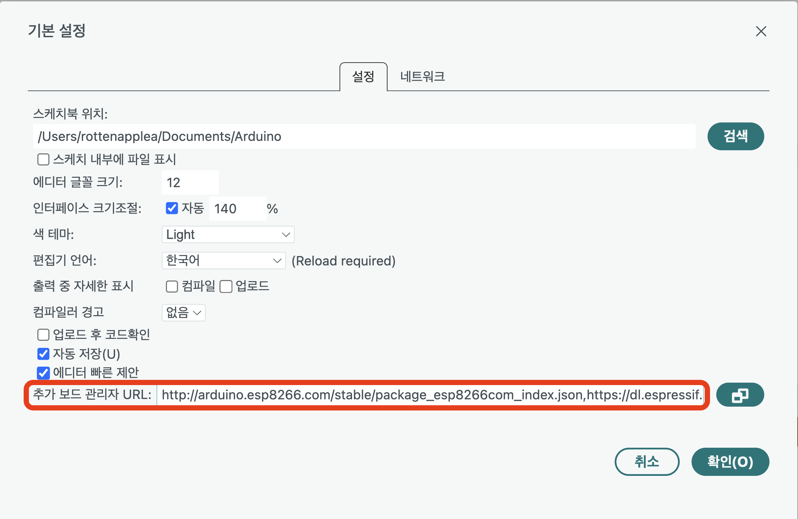
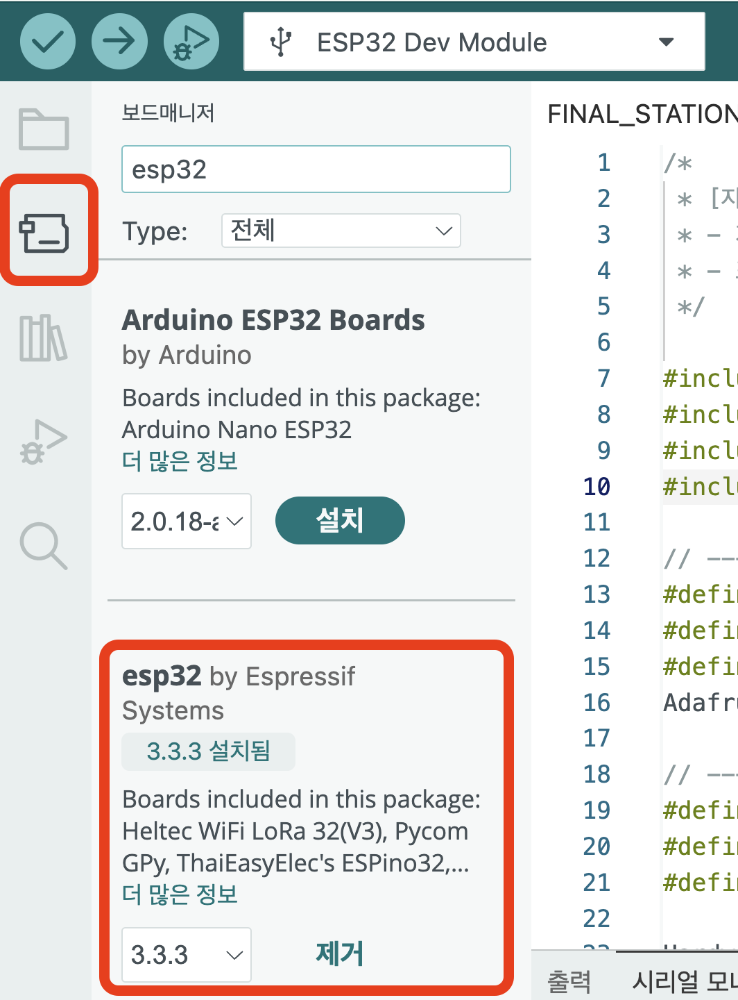
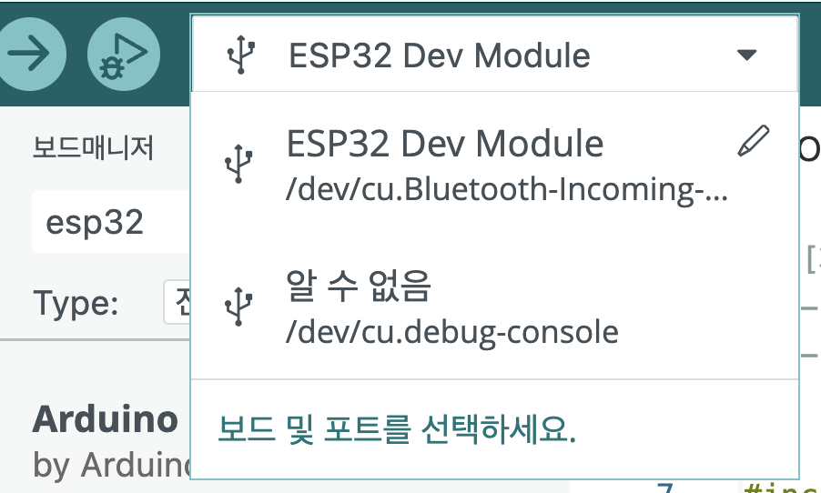

임베디드 시스템 개발의 첫걸음은 개발 환경을 구축하는 것입니다. 특히 ESP32와 같은 MCU를 아두이노 IDE에서 사용하려면 `보드 매니저 설정`과 드라이버 설치 등 몇 가지 추가적인 작업이 필요합니다.

이번 포스팅에서는 맥(macOS)과 윈도우(Windows) 환경에서 아두이노 IDE를 설치하고, 캔위성 프로젝트에 필요한 라이브러리들을 세팅하는 과정을 상세히 다루겠습니다.

---

# 1. Arduino IDE 설치

가장 먼저 통합 개발 환경(IDE)을 설치해야 합니다. 구버전보다는 최신 기능을 지원하는 Arduino IDE 2.x 버전을 권장합니다.

다운로드: [Arduino 공식 홈페이지](https://www.arduino.cc/en/software)

설치 방법: 운영체제에 맞는 설치 파일(.dmg 또는 .exe)을 다운로드하여 실행합니다.

:::tip[Mac 사용자 팁]
맥 사용자는 .dmg 파일을 열고 Arduino 아이콘을 Applications 폴더로 드래그하면 설치가 완료됩니다. 실행 시 "확인되지 않은 개발자" 경고가 뜨면 시스템 설정 > 개인정보 보호 및 보안에서 "그대로 열기"를 클릭하세요.
:::
---
# 2. ESP32 보드 매니저 설정

아두이노 IDE는 기본적으로 Uno, Nano 등 만 인식합니다. `ESP32`를 사용하려면 `보드 매니저 URL`을 추가해야 합니다.




### 설정 메뉴 진입:

Mac: 상단 메뉴바 Arduino IDE > Settings... (단축키: ⌘ + ,)

Windows: File > Preferences (단축키: Ctrl + ,)

### URL 추가:

Additional boards manager URLs 입력란에 아래 주소를 복사하여 붙여넣습니다.

https://espressif.github.io/arduino-esp32/package_esp32_index.json


### 보드 패키지 설치:

<div class="w-1/2 mx-auto">



</div>


좌측 사이드바의 **Boards Manager** 아이콘 클릭 (또는 `Tools` > `Board` > `Boards Manager`)

검색창에 `esp32`입력

**esp32 by Espressif Systems** 설치 (최신 버전 권장)

설치가 완료되면 `Tools` > `Board` 메뉴에서 `ESP32 Dev Module`을 선택할 수 있습니다.

---

# 3. 라이브러리 관리 및 저장 위치
이 프로젝트에서는 GPS, 각종센서, OLED등을 제어하기 위해 다양한 외부 라이브러리를 사용합니다.

## 3-1. 라이브러리 저장 위치

:::note[운영체제별 기본 경로]

macOS: /Users/{사용자이름}/Documents/Arduino/libraries

Windows: C:\Users\{사용자이름}\Documents\Arduino\libraries
:::

## 3-2. 라이브러리 설치

아두이노 IDE의 `라이브러리 매니저`(보드매니저 바로 아래있습니다.)

(Sketch > Include Library > Manage Libraries... 또는 단축키 `⌘/Ctrl + Shift + I`)

아래 라이브러리들을 검색하여 설치하세요.

| 라이브러리명 | 용도 및 설명 | 비고 |
| :--- | :--- | :--- |
| **Adafruit MPU6050** | 6축 IMU 센서(가속도/자이로) 제어 | `Adafruit Unified Sensor` 등 의존성 라이브러리 함께 설치 |
| **Adafruit BMP280 Library** | 기압 및 고도 측정 센서 제어 | |
| **Adafruit AHTX0** | 정밀 온습도 센서 (AHT20) 제어 | |
| **Adafruit SSD1306** | 0.96인치 OLED 디스플레이 제어 | `Adafruit GFX Library` 함께 설치 |
| **TinyGPSPlus** | NMEA GPS 데이터 파싱 | `TinyGPS++` 로 검색될 수 있음(by Mikal Hart) |

---

# 4. USB 드라이버 설치(CP210x/CH340) 윈도우만

ESP32 보드를 PC에 연결했을 때 포트가 인식되지 않는다면 높은 확률로 USB-to-UART 브릿지 드라이버가 필요한 경우입니다. 사용하는 보드의 칩셋을 확인하고 설치하세요.

CP210x: [Silicon Labs](https://www.silabs.com/developers/usb-to-uart-bridge-vcp-drivers) 드라이버 다운로드 (대부분의 정품/고급형 보드)

CH340: [WCH](http://www.wch-ic.com/downloads/CH341SER_ZIP.html) 드라이버 다운로드 (저가형/호환 보드)

:::tip[설치 확인]
드라이버 설치 후 보드를 연결하면 Tools > Port 메뉴에 /dev/cu.SLAB_USBtoUART (Mac) 또는 COM3 (Windows)와 같이 새로운 포트가 나타나야 합니다.
:::

# 5. 예제코드 실행해보기 (내장 LED깜빡이기)
설정이 제대로 되었는지 확인을 위해 아래 코드를 아두이노 IDE에 붙여넣기 후 실행해 봅시다.
```c++
// ESP32 내장 LED (보통 GPIO 2번)
#define LED_PIN 2

void setup() {
  pinMode(LED_PIN, OUTPUT);
}

void loop() {
  digitalWrite(LED_PIN, HIGH); // 켜기
  delay(1000);
  digitalWrite(LED_PIN, LOW);  // 끄기
  delay(1000);
}
```
<div class="w-1/2 mx-auto">



</div>


보드(ESP32 Dev Module)와 포트를 올바르게 선택합니다.

업로드 버튼(→)을 클릭합니다.

`Connecting...` 메시지가 뜰 때 보드의 `BOOT 버튼`을 1~2초간 눌러줘야 할 수도 있습니다.


파란색 LED가 깜빡인다면 개발 환경 셋팅 성공!


<div style="text-align: end;">

다음 연결된 포스팅으로 이동하기 [CanSat#3 NEOPIXEL](/posts/embedded-system/3_neopixel/)

</div>