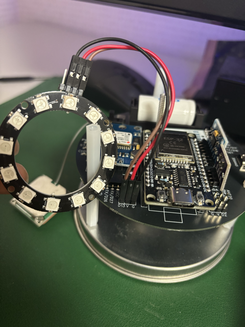

현재 위성에는 모니터가 달려있지 않기 때문에, 현재 위성이 어떤 상태인지(부팅 중인지, GPS를 찾고 있는지, 에러가 났는지)를 직관적으로 알기 어렵습니다.

이때 **RGB LED (NeoPixel)** 를 사용하면 다양한 색상으로 위성의 상태를 표현할 수 있습니다. 이번 포스트에서는 `Adafruit NeoPixel 라이브러리(설치필요)`를 사용하여 LED의 색상을 제어하는 방법을 알아봅니다.

::gitHub{repo="adafruit/Adafruit_NeoPixel"}

---

# 1. NeoPixel이란?

NeoPixel(네오픽셀)은 WS2812B 칩이 내장된 RGB LED입니다.

- 특징: 단 하나의 신호선(Data Pin)으로 여러개의 LED를 개별 제어할 수 있습니다.
- 원리: 24bit 색상 데이터(Red 8bit, Green 8bit, Blue 8bit)를 PWM 신호로 변환하여 표현함.
- 장점: 배선이 매우 간단하며(VCC, GND, DIN) 라이브러리를 통해 쉽게 제어할 수 있음.

---

# 2. 하드웨어 연결
[우리들캔위성(S2B구매제품)](https://www.s2b.kr/S2BNCustomer/rema100.do)에서 제공하는 PCB에는 NEOPIXEL을 연결하는 단자가 그림과 같이 만들어져있음. 참고로 가격이 사악하다. 약 13만원

#[X]TODO: 오른쪽 이미지 회로도로 바꾸기
<div class="w-full mx-auto flex justify-center">

<div class="w-1/2 mr-1 flex justify-center">


</div>

<div class="w-1/2 ml-1 flex justify-center">


</div>
</div>

| ESP32 Pin | NeoPixel Pin |
| :--- | :--- |
| **5V (or 3.3V)** | **VCC (5V 권장)** |
| **GND** | **GND** |
| **GPIO 13** | **DIN (Data In) DI라고 표기되어있기도함.** |

:::warning[전원 주의]
네오픽셀은 밝기에 따라 전류 소모량이 큽니다. 너무 많은 LED를 최대 밝기로 켜면 ESP32의 레귤레이터가 과열될 수 있으니, 테스트 시에는 밝기(setBrightness)를 낮게 설정하세요.
:::

---

# 3. 라이브러리 설치
아두이노 IDE의 라이브러리 매니저에서 다음 라이브러리를 설치해야 합니다.

이름: Adafruit NeoPixel

설치 방법: Sketch > Include Library > Manage Libraries...에서 `'Adafruit NeoPixel'`검색 후 설치


---

# 4. 예제 코드 작성

깃허브에 올라와 있는 NEOPIXEL 예제 코드를 참고하세요.
::github{repo="KKK12142/CANSAT_project"}

### 기본 설정 및 객체 생성

```c++
#include <Adafruit_NeoPixel.h> //사용하는 라이브러리 선언 필수로해줘야함.

// 핀 및 개수 설정
#define PIN        13   // ESP32 데이터 핀 13번에 연결했다는 말
#define NUMPIXELS  12   // LED 개수 (링 타입)

// NeoPixel 객체 생성
// NEO_GRB + NEO_KHZ800: 일반적인 WS2812B 스트립 설정
//네오픽셀의 라이브러리에서 pixels 라는 이름으로 객체를 생성 (아래 설명참조)
Adafruit_NeoPixel pixels(NUMPIXELS, PIN, NEO_GRB + NEO_KHZ800);


void setup() {
  pixels.begin();           // 네오픽셀 제어 시작
  pixels.setBrightness(30); // 밝기 조절 (0~255), 전력 소모를 위해 낮게 설정
}
```

아래 코드에 대해서 알아봅시다.
```c++
Adafruit_NeoPixel pixels(NUMPIXELS, PIN, NEO_GRB + NEO_KHZ800);
```
이 코드는 `Adafruit_NeoPixel 라이브러리`에서 제공하는 객체 생성 코드입니다. `pixels`라는 이름으로 객체를 생성하겠다는 코드 입니다. 객체 이름은 자유롭게 바꿔도 상관 없습니다. 예를 들면 `LED`라고 이름을 지을 수 도 있습니다. 객체를 생성하는 이유는 `Adafruit_NeoPixel 라이브러리`에서 제공하는 다양한 함수들을 사용하기 위함입니다. Adafruit_NeoPixel 안에는 begin(), show(), setPixelColor(), setBrightness() 등의 다양한 함수들이 있고 이를 이제 생성한 객체 이름을 이용해 pixels.begin(), pixels.show(), pixels.setPixelColor(), pixels.setBrightness() 처럼 사용할 수 있습니다.

### 색상 제어 함수(setLedColor)

```c++
// R, G, B 색상(0~255)을 받아 모든 픽셀의 색을 변경하는 함수
void setLedColor(int r, int g, int b) {
  for(int i = 0; i < NUMPIXELS; i++) { //for(변수선언; 조건 ; 변수값 +1증가시키기)
    // i번째 픽셀에 색상 설정 (메모리에 저장)
    pixels.setPixelColor(i, pixels.Color(r, g, b));
  }
  // 실제 LED에 색상 출력 (반드시 호출해야 함!)
  pixels.show();
}
```
이 코드는 `setLedColor` 라는 함수를 정의 하는 부분입니다. 여기서 for 반복문을 통하여 NUMPIXELS만큼 반복하여 각 LED에 색상을 설정합니다.

`setPixelColor` 함수는 변수로 `led의 번호`와 `색상 값`을 파라미터로 받아서 LED의 색상을 설정합니다.
`Color` 함수는 R, G, B 값을 받아서 색상을 32비트 (ex 0x00RRGGBB)로 변환하여 합니다.

예를 들어 pixels.Color(255, 0, 0)은 0x00FF0000를 반환합니다.

### 기본 반복 코드
```c++
void loop() {
  // 1. 빨간색 (에러 상태)
  setLedColor(255, 0, 0);
  delay(1000);

  // 2. 초록색 (정상/GPS 수신 완료)
  setLedColor(0, 255, 0);
  delay(1000);

  // 3. 파란색 (대기 중/통신 중)
  setLedColor(0, 0, 255);
  delay(1000);
  
  // 4. 끄기
  setLedColor(0, 0, 0);
  delay(1000);
}
```
