캔위성에 AHT20온습도 센서와 BMP280 기압/고도 센서를 연결하여 위성의 현재 고도 및 온도 습도 값을 측정할 수 있도록 하는 방법을 포스팅해보겠습니다.

# 1. 센서 사양 및 특징
두 센서 모두 `I2C`(Inter-Intergrated Circuit)프로토콜을 사용하므로, 두 개의 신호선(`SDA`, `SCL`)로 데이터를 주고받을 수 있습니다. 우리들 캔위성에서는 AHT20과 BMP280이 하나로 합쳐져있는 아래 모듈을 사용합니다.
<div class="w-1/2 mx-auto flex justify-center">


</div>

| 특징 | AHT20 | BMP280|
| :--- | :--- | :--- |
| **I2C 주소** | 0x38 | 0x76 또는 0x77(짭) |
| **측정 범위** | -40 ~ 85°C(온도), 0 ~ 100% (습도) | 300hPa ~ 1100hPa(기압), 0m ~ 9000m(고도) |
| **정확도** | ± 0.5°C (온도), ± 2% (습도) | ± 0.5hPa (기압), ± 0.5m (고도) |
| **센서 제조사** | Adafruit | Bosch |

---

# 2. 하드웨어 설계

`I2C` 통신을 이용하기때문에 ESP32의 `SDA(21핀)`, `SCL(22핀)` 핀을 사용하여 데이터를 주고받습니다. 여러개의 센서가 같은 I2C 주소를 사용하지 않기 때문에 모두 같은 핀에 연결되어있어도 서로 다른 데이터를 주고받을 수 있습니다.

<div class="w-1/2 mx-auto flex justify-center">


</div>

---

# 3. 기압 고도계의 원리

BMP280은 직접적으로 '고도'를 측정하는 것이 아니라 '기압'을 측정합니다. 고도가 높아질수록 공기 밀도가 낮아져 기압이 떨어지는 원리를 이용합니다. 위성에서 사용하는 고도 계산 수식은 다음과 같습니다.

$$
Altitude(고도) = 44330 \times \left(1.0 - \left(\frac{P}{P_0}\right)^{0.1903}\right)
$$

이 수식에서 $P$는 현재 측정된 기압, $P_0$는 표준 기압
(Sea Level Pressure 1013.25hPa)을 의미합니다.

:::tip[상대 고도 측정]
실제 캔위성 운용 시에는 해면 기압 대신 이륙 지점의 지상 기압을 $P_0$로 설정하여, 지면으로부터의 상대적인 높이를 계산하는 것이 훨씬 더 정확합니다.
:::

---

# 4. 소프트웨어 구현

### 4-1. 라이브러리 및 객체 선언


```c++
//라이브러리 선언 필수로 해줘야 함.
#include <Adafruit_AHTX0.h> 
#include <Adafruit_BMP280.h>

//aht, bmp이름으로 센서 객체 선언
Adafruit_AHTX0 aht;
Adafruit_BMP280 bmp; 

```

### 4-2. Setup함수 : 초기화 및 기준기압 설정

```c++
void setup() {
  Serial.begin(115200); // 시리얼 통신 속도 115200으로 하고 초기화
  Wire.begin(21, 22); // 하드웨어 I2C 핀을 21, 22번핀으로 하고 초기화

  // aht.begin()함수가 초기화 되지 않으면 false를 반환하므로 !false 이면 true 이므로 아래 조건문이 실행된다.
  if (!aht.begin()) { 
    Serial.println("Could not find AHT20");
    while (1);
  }

  // bmp.begin()함수가 초기화 되지 않으면 false를 반환하므로 !false 이면 true 이므로 아래 조건문이 실행된다.
  // bmp.begin(주소) 0x76 또는 0x77임
  if (!bmp.begin(0x76) && !bmp.begin(0x77)) {
    Serial.println("Could not find BMP280");
    while (1);
  }

  // 초기 지상 기압 저장 (고도 0m 기준점 설정)
  base_pressure = bmp.readPressure() / 100.0;
  Serial.println("센서 초기화 완료");
}
```
### 4-3. Loop함수 : 데이터 수집 및 출력

```c++
void loop() {
  // sesors_event_t 구조체는 센서의 이벤트 데이터를 저장하는 구조체임 humidity, temp라는 이름으로 변수를 저장함.
  sensors_event_t humidity, temp;
  // aht.getEvent(&humidity, &temp);는 AHT20 센서의 이벤트 데이터를 humidity, temp 구조체에 저장하는 함수임.
  aht.getEvent(&humidity, &temp); // AHT20 데이터 수집

  // bmp.readAltitude(base_pressure)는 BMP280 센서의 기압 데이터를 읽는 함수임.
  // 현재 압력을 측정하고 base_pressure와 비교해 상대 고도를 계산함.
  float altitude = bmp.readAltitude(base_pressure);

  // 데이터 포맷팅 출력 %.1f : 소수점 1자리, %.0f : 소수점 0자리, %.2f : 소수점 2자리 까지 출력하라는 뜻
  Serial.printf("Temp: %.1fC, Humi: %.0f%%, Alt: %.2fm\n", 
                temp.temperature, humidity.relative_humidity, altitude);

  delay(1000);
}
```

# 5. 실행 흐름도
시스템 초기화 및 데이터 수집 루프의 상세 흐름도 입니다.


