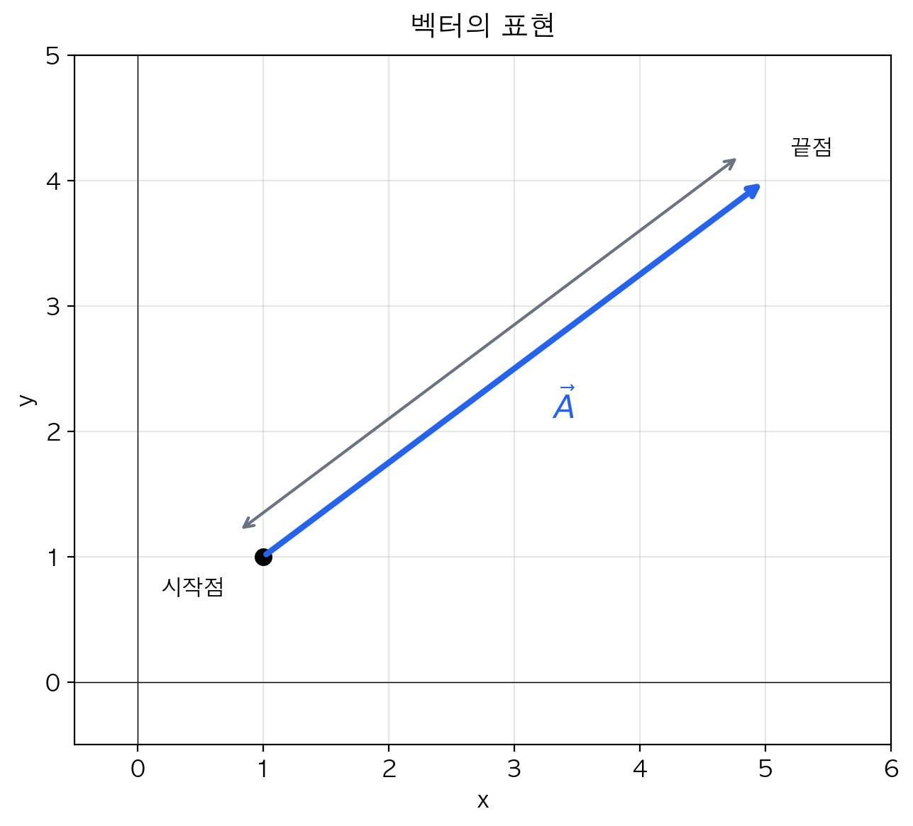

#TODO 벡터의 표현 작성하기

# 벡터의 표현

물리학에서 자연 현상을 정확하게 기술하려면 단순히 "얼마나"뿐만 아니라 "어느 방향으로"까지 표현해야 할 때가 많다.
"공이 10 m/s로 움직인다"는 정보만으로는 공이 어디로 갈지 알 수 없다. 위로 던진 공인지, 아래로 떨어지는 공인지, 옆으로 굴러가는 공인지 구분할 수 없기 때문이다. 이처럼 크기와 방향을 함께 나타내야 하는 물리량을 다루기 위해 우리는 벡터라는 도구를 사용한다.
이 단원에서는 벡터를 어떻게 표현하고, 어떻게 다루는지 배운다. 벡터는 앞으로 배울 힘, 운동량, 전기장 등 거의 모든 물리 개념의 기초가 되므로, 여기서 확실히 익혀두자.

## 학습 목표
> - 스칼라와 벡터의 차이를 설명할 수 있다.
> - 벡터를 화살표, 성분, 단위벡터로 표현할 수 있다.
> - 벡터의 크기와 방향을 구할 수 있다.

---

## 1. 스칼라와 벡터

물리량은 방향을 가질 수 없거나 가질 수 있는 것으로 두 종류로 나눌 수 있다.

:::important

**스칼라 : 크기만 가지는 물리량**

**벡터 : 크기와 방향을 가지는 물리량**

:::

| 스칼라(Scalar) | 벡터(Vector) |
|:--------:|:------:|
| 질량 5 kg| 변위 동쪽으로 10m |
| 온도 25°C| 속도 북쪽으로 5m/s |
| 시간 3초| 힘 아래로 20N |
| 에너지 100 J| 가속도 오른쪽으로 2m/s² |

:::note[생각해보기]

**"자동차가 100 km/h로 달린다"와 "자동차가 북쪽으로 100 km/h로 달린다"는 어떻게 다를까?**
:::

---

## 2. 벡터의 표기법

벡터는 여러 가지 방법으로 표기할 수 있다.

### 화살표 표기
문자 위에 화살표를 그린다.
$$
\vec{A}, \quad \vec{F}, \quad \vec{v}
$$

### 굵은 글씨 표기
주로 교재나 논문에서 사용한다.
$$
\mathbf{A}, \quad \mathbf{F}, \quad \mathbf{v}
$$

### 크기 표기
벡터의 크기(스칼라)는 절댓값 기호를 쓰거나 화살표 없이 쓴다.
$$
|\vec{A}| = A
$$

---

## 3. 벡터의 화살표 표현

벡터를 그림으로 나타낼 때는 **화살표**를 사용한다.

  

  
  

- **화살표의 길이** → 벡터의 크기
- **화살표의 방향** → 벡터의 방향
- **화살표의 시작점** → 작용점

### 예시
속도 $\vec{v}$ = 동쪽으로 5 m/s를 화살표로 나타내면:

  

  
  

:::tip[그리기 규칙]
1. 적절한 축척을 정한다 (예: 1 m/s = 1 cm)  
2. 시작점을 찍는다 (보통은 물체위나 질량중심에 찍는다.)
3. 정해진 방향으로 크기에 맞는 길이의 화살표를 그린다
:::

---

## 4. 벡터의 성분 표현

2차원 평면에서 벡터는 **x성분**과 **y성분**으로 분해할 수 있다.

### 성분 분해

  

  
  

벡터 $\vec{A}$가 x축과 각도 $\theta$를 이룰 때:

$$
A_x = A\cos\theta
$$
$$
A_y = A\sin\theta
$$

### 성분 표기
$$
\vec{A} = (A_x, A_y)
$$

### 예시 문제
> 크기가 10 N이고 x축과 30° 방향인 힘 $\vec{F}$의 성분을 구하시오.

**풀이**

  

  
  

$$
F_x = 10 \times \cos30° = 10 \times \frac{\sqrt{3}}{2} \approx 8.66 \text{ N}
$$
$$
F_y = 10 \times \sin30° = 10 \times \frac{1}{2} = 5 \text{ N}
$$
$$
\therefore \vec{F} = (8.66, 5) \text{ N}
$$

---

## 5. 성분으로부터 크기와 방향 구하기

반대로, 성분을 알면 크기와 방향을 구할 수 있다.

### 크기
피타고라스 정리를 이용한다.
$$
|\vec{A}| = \sqrt{A_x^2 + A_y^2}
$$

### 방향
삼각비를 이용한다.
$$
\tan\theta = \frac{A_y}{A_x} \quad \Rightarrow \quad \theta = \tan^{-1}\left(\frac{A_y}{A_x}\right)
$$

### 예시 문제
> $\vec{v} = (3, 4)$ m/s인 속도의 크기와 방향을 구하시오.

**풀이**
$$
|\vec{v}| = \sqrt{3^2 + 4^2} = \sqrt{9 + 16} = \sqrt{25} = 5 \text{ m/s}
$$
$$
\theta = \tan^{-1}\left(\frac{4}{3}\right) \approx 53.1°
$$

---

## 6. 단위벡터

**단위벡터**는 크기가 1인 벡터로, 오직 **방향만** 나타낸다.

### 기본 단위벡터
- $\hat{i}$ (또는 $\hat{x}$): x축 양의 방향 단위벡터
- $\hat{j}$ (또는 $\hat{y}$): y축 양의 방향 단위벡터
- $\hat{k}$ (또는 $\hat{z}$): z축 양의 방향 단위벡터

### 단위벡터를 이용한 표현
$$
\vec{A} = A_x\hat{i} + A_y\hat{j}
$$

### 예시
$\vec{F} = (8.66, 5)$ N을 단위벡터로 표현하면:
$$
\vec{F} = 8.66\hat{i} + 5\hat{j} \text{ N}
$$

:::tip[왜 단위벡터를 쓸까?]
성분 표기 $(A_x, A_y)$는 좌표를 나타내는 것처럼 보일 수 있다. 단위벡터 표기는 이것이 벡터임을 명확하게 보여준다.
:::

---

## 7. 시뮬레이션으로 연습하기

아래 PhET 시뮬레이션에서 직접 벡터를 만들고 성분을 확인해보자.

<iframe src="https://phet.colorado.edu/sims/html/vector-addition/latest/vector-addition_ko.html"
        width="800"
        height="600"
        allowfullscreen>
</iframe>

### 활동 안내
1. **벡터 만들기**: 화살표를 드래그하여 벡터를 만들어보자
2. **성분 확인**: 벡터의 x성분, y성분 값을 확인하자
3. **각도 변경**: 같은 크기에서 각도를 바꾸면 성분이 어떻게 변하는가?
4. **벡터 합성**: 두 벡터를 더하면 어떤 결과가 나오는가?

---

## 8. 확인 문제

### 문제 1
다음 중 벡터인 것을 모두 고르시오.
- (가) 질량 5 kg
- (나) 변위 3 m (동쪽)
- (다) 속력 10 m/s
- (라) 가속도 2 m/s² (북쪽)

정답 확인

**(나), (라)**

(가) 질량은 크기만 있는 스칼라  
(다) 속력은 속도의 크기이므로 스칼라  
(나) 변위는 방향이 있으므로 벡터  
(라) 가속도는 방향이 있으므로 벡터

---

### 문제 2
크기가 20 N이고 x축과 60° 방향인 힘의 x성분과 y성분을 구하시오.

정답 확인

$$F_x = 20\cos60° = 20 \times 0.5 = 10 \text{ N}$$
$$F_y = 20\sin60° = 20 \times \frac{\sqrt{3}}{2} \approx 17.3 \text{ N}$$

---

### 문제 3
$\vec{A} = (5, 12)$인 벡터의 크기를 구하시오.

정답 확인

$$|\vec{A}| = \sqrt{5^2 + 12^2} = \sqrt{25 + 144} = \sqrt{169} = 13$$

---

### 문제 4
$\vec{B} = 6\hat{i} - 8\hat{j}$인 벡터의 크기와 방향(x축 기준)을 구하시오.

정답 확인

**크기:**
$$|\vec{B}| = \sqrt{6^2 + (-8)^2} = \sqrt{36 + 64} = \sqrt{100} = 10$$

**방향:**
$$\theta = \tan^{-1}\left(\frac{-8}{6}\right) \approx -53.1°$$

(x축 아래쪽으로 53.1°, 또는 4사분면 방향)

---

## 핵심 정리

| 표현 방법 | 예시 | 특징 |
|-----------|------|------|
| 화살표 | ![작은화살표] | 직관적, 그래프에서 사용 |
| 성분 표기 | $(A_x, A_y)$ | 계산에 편리 |
| 단위벡터 표기 | $A_x\hat{i} + A_y\hat{j}$ | 벡터임을 명확히 표현 |

### 핵심 공식
$$
\boxed{A_x = A\cos\theta, \quad A_y = A\sin\theta}
$$
$$
\boxed{|\vec{A}| = \sqrt{A_x^2 + A_y^2}, \quad \theta = \tan^{-1}\left(\frac{A_y}{A_x}\right)}
$$
