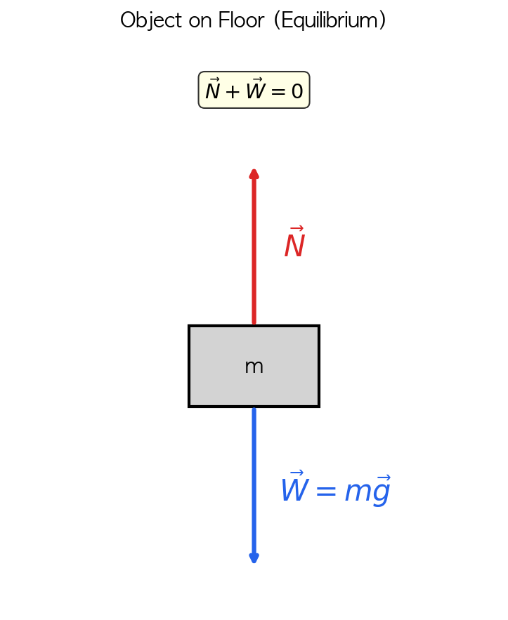
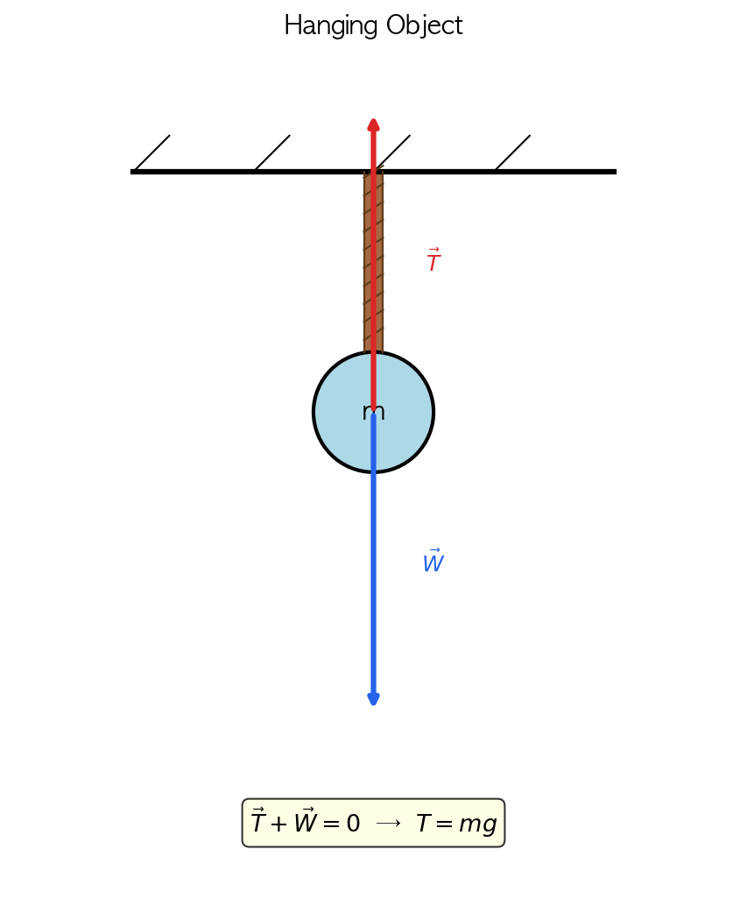
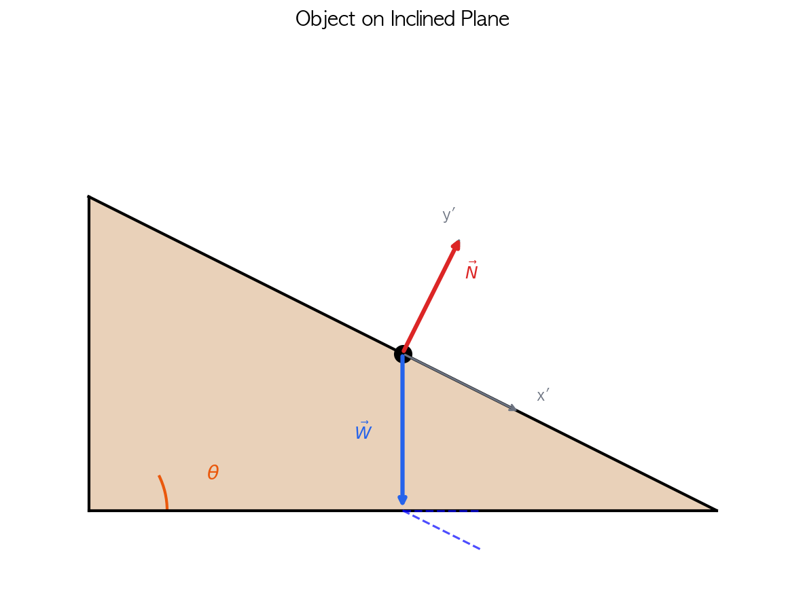
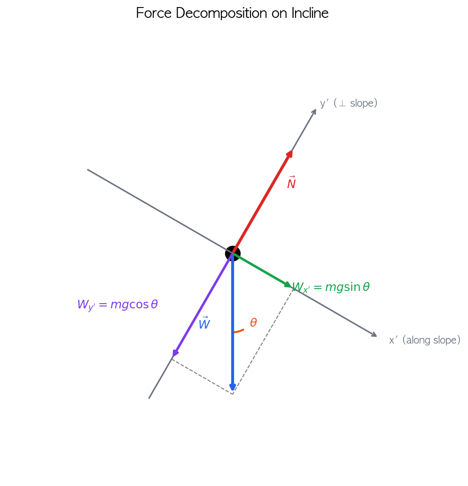
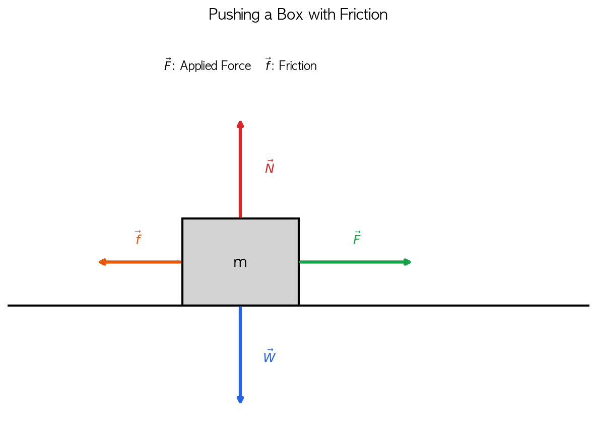
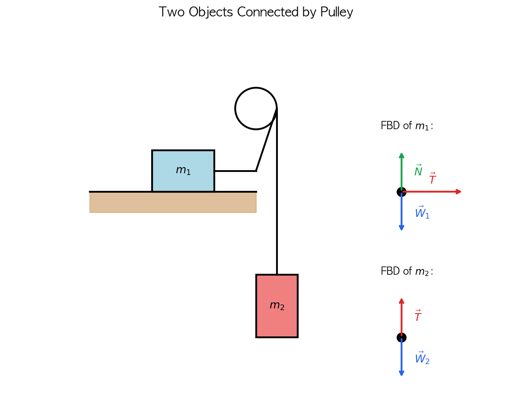

# 자유물체도 그리기

힘의 문제를 풀 때 가장 먼저 해야 할 일은 **물체에 작용하는 모든 힘을 파악하는 것**이다. 복잡한 상황에서 힘을 빠뜨리거나 잘못 그리면 문제를 풀 수 없다. 이때 사용하는 도구가 바로 **자유물체도(Free Body Diagram, FBD)** 이다.

자유물체도는 분석하려는 물체를 주변 환경에서 분리하고, 그 물체에 작용하는 모든 힘을 화살표로 표현한 그림이다.

---

## 학습 목표

> - 자유물체도의 개념과 필요성을 설명할 수 있다.
> - 주어진 상황에서 물체에 작용하는 힘을 파악할 수 있다.
> - 자유물체도를 단계별로 그릴 수 있다.

---

## 1. 자유물체도란?

### 실제 상황 vs 자유물체도

왼쪽은 바닥에 놓인 상자의 실제 상황이다. 오른쪽은 같은 상황에 상자의 자유물체도를 그린것이다.

자유물체도에서는:
- 물체를 **점** 또는 간단한 도형으로 표현
- 물체에 작용하는 **모든 힘**을 화살표로 표시
- 각 힘에 **기호와 이름**을 붙임

:::tip[왜 자유물체도가 필요한가?]
복잡한 상황에서 힘을 하나라도 빠뜨리면 잘못된 답이 나온다. 자유물체도를 그리면 힘을 체계적으로 정리할 수 있고, 빠진 힘이 없는지 확인할 수 있다.
:::

---

## 2. 자유물체도 그리기 4단계

| 단계 | 설명 |
|------|------|
| **Step 1** | 분석할 물체를 주변에서 **분리**한다 |
| **Step 2** | 물체의 무게 중심에 **점**을 찍는다 |
| **Step 3** | 물체에 작용하는 모든 **힘을 화살표**로 그린다 |
| **Step 4** | 각 힘에 **기호와 이름**을 붙인다 |

---

## 3. 자주 등장하는 힘들

자유물체도를 그리려면 어떤 힘들이 작용하는지 알아야 한다.

| 힘 | 기호 | 방향 | 발생 조건 |
|---|---|---|---|
| **중력 (무게)** | $\vec{W}$ 또는 $m\vec{g}$ | 항상 아래 | 질량이 있으면 항상 |
| **수직항력** | $\vec{N}$ | 접촉면에 수직 | 표면과 접촉할 때 |
| **장력** | $\vec{T}$ | 줄을 따라 당기는 방향 | 줄/끈으로 연결될 때 |
| **마찰력** | $\vec{f}$ | 운동 반대 방향 | 거친 표면에서 |
| **가해진 힘** | $\vec{F}$ | 힘을 가하는 방향 | 밀거나 당길 때 |

:::tip[힘을 찾는 요령]
1. 중력은 **항상** 있다 (질량이 있으면)
2. 접촉한 면이 있으면 **수직항력** 확인
3. 줄/끈이 있으면 **장력** 확인
4. 표면이 거칠면 **마찰력** 확인
5. 누가 밀거나 당기면 **외력** 확인
:::

---

## 4. 바닥 위 정지한 물체

 

 
 

 

    

   ### 상황
   질량 $m$인 물체가 수평면 위에 정지해 있다.
    

    

   ### 작용하는 힘
   - **중력** $\vec{W} = m\vec{g}$: 아래 방향
   - **수직항력** $\vec{N}$: 위 방향 (바닥이 물체를 떠받침)
    

 

### 평형 조건
물체가 정지해 있으므로:
$$
\vec{N} + \vec{W} = 0 \quad \Rightarrow \quad N = mg
$$

---

## 5. 줄에 매달린 물체

### 상황
질량 $m$인 물체가 줄에 매달려 정지해 있다.

### 작용하는 힘
- **중력** $\vec{W}$: 아래 방향
- **장력** $\vec{T}$: 위 방향 (줄이 물체를 당김)

### 평형 조건
$$
\vec{T} + \vec{W} = 0 \quad \Rightarrow \quad T = mg
$$

---

## 6. 경사면 위 물체

### 상황
경사각 $\theta$인 경사면 위에 물체가 놓여 있다.

### 작용하는 힘
- **중력** $\vec{W}$: 연직 아래 방향
- **수직항력** $\vec{N}$: 경사면에 수직인 방향

### 좌표계 설정
경사면 문제에서는 **경사면을 따라 x'축, 경사면에 수직으로 y'축**을 잡으면 편리하다.

### 힘의 분해

### 중력을 경사면 좌표계로 분해하면

| 성분 | 식 | 의미 |
|------|-----|------|
| 경사면 방향 | $W_{x'} = mg\sin\theta$ | 물체를 빗면 아래로 끌어내리는 성분 |
| 경사면 수직 | $W_{y'} = mg\cos\theta$ | 경사면에 수직으로 누르는 성분 |

### 평형 조건 (경사면 수직 방향)

새로 설정한 x'y'(prime) 좌표계에 대해 수직항력 $N$은 경사면 수직으로 누르는 성분 $W_{y'}$과 크기가 같다. (y'방향으로 물체는 이동하지 않으므로)

$$
N = mg\cos\theta
$$

:::warning
**주의!**  
경사면에서 $N \neq mg$이다. 수직항력은 $N = mg\cos\theta$로, 평지보다 작다.
:::

---

## 7. 마찰력이 있는 경우

### 상황
수평면 위의 물체를 오른쪽으로 밀고 있다.

### 작용하는 힘
- **중력** $\vec{W}$: 아래
- **수직항력** $\vec{N}$: 위
- **가한 힘** $\vec{F}$: 오른쪽
- **마찰력** $\vec{f}$: 왼쪽 (운동 반대 방향)

### 마찰력의 방향
마찰력은 항상 **상대 운동을 방해하는 방향**으로 작용한다.

### 문제 1
위 상황에서 질량 $m = 2kg$, 작용하는 힘 $F = 10N$ 일때 물체의 가속도 $a = 3m/s^2$이다. 이때 마찰력의 크기와 방향을 구하라.

정답 확인

마찰력은 항상 상대 운동을 방해하는 방향으로 작용한다. 따라서 이 경우 마찰력은 **왼쪽**으로 작용한다.

$$
10 - f = ma \\ 
f = 10 - ma = 10 - 2 \times 3 = 4N
$$

---

## 8. 도르래로 연결된 두 물체

 

 
 

### 상황
도르래를 통해 두 물체가 줄로 연결되어 있다.

### 핵심 포인트
- 줄의 질량을 무시하면, **줄 전체에 걸쳐 장력은 동일**하다
- 각 물체에 대해 **별도의 자유물체도**를 그린다

### 물체 $m_1$에 작용하는 힘과 운동방정식
- 수직항력 $\vec{N}$, 중력 $\vec{W}_1$, 장력 $\vec{T}$

두 물체는 실로 연결되어 동일한 크기의 가속도 $a$로 운동한다.

#### x축 방향 (수평)
$$
T = m_1a \quad \cdots (1)
$$

#### y축 방향 (수직)
$m_1$은 수직 방향으로 움직이지 않으므로:
$$
N - m_1g = 0 \quad \Rightarrow \quad N = m_1g
$$

### 물체 $m_2$에 작용하는 힘과 운동방정식
- 장력 $\vec{T}$: 위 방향
- 중력 $\vec{W}_2 = m_2g$: 아래 방향

$m_2$는 아래 방향으로 가속도 $a$로 운동한다. (아래 방향을 양의 방향으로 설정)

$$
m_2g - T = m_2a \quad \cdots (2)
$$

### 연립방정식 풀이

식 (1)을 식 (2)에 대입하면:
$$
m_2g - m_1a = m_2a
$$

$$
m_2g = m_1a + m_2a = (m_1 + m_2)a
$$

따라서 **가속도**는:
$$
\boxed{a = \frac{m_2}{m_1 + m_2}g}
$$

**장력**은 식 (1)에 대입하여:
$$
\boxed{T = \frac{m_1 m_2}{m_1 + m_2}g}
$$

:::tip[결과 해석]
- $m_2 \gg m_1$이면: $a \approx g$, $T \approx m_1 g$ (가벼운 물체가 빠르게 끌려감)
- $m_1 \gg m_2$이면: $a \approx 0$, $T \approx m_2 g$ (거의 움직이지 않음)
- $m_1 = m_2$이면: $a = \frac{g}{2}$, $T = \frac{mg}{2}$
:::

### 문제
마찰이 없는 수평면 위에 $m_1 = 3\text{ kg}$인 물체가 놓여 있고, 도르래를 통해 $m_2 = 2\text{ kg}$인 물체와 연결되어 있다. 줄의 질량은 무시한다. (g = 10 m/s²)

1. 두 물체의 가속도를 구하시오.
2. 줄의 장력을 구하시오.

정답 확인

**1. 가속도**
$$
a = \frac{m_2}{m_1 + m_2}g = \frac{2}{3 + 2} \times 10 = \frac{2}{5} \times 10 = 4 \text{ m/s}^2
$$

**2. 장력**
$$
T = \frac{m_1 m_2}{m_1 + m_2}g = \frac{3 \times 2}{3 + 2} \times 10 = \frac{6}{5} \times 10 = 12 \text{ N}
$$

**검산**: $m_1$에 대해 $T = m_1 a = 3 \times 4 = 12$ N ✓

---

## 9. 자유물체도 체크리스트

자유물체도를 그린 후 확인할 사항:

- [ ] 중력을 그렸는가?
- [ ] 접촉면이 있다면 수직항력을 그렸는가?
- [ ] 줄이 있다면 장력을 그렸는가?
- [ ] 마찰이 있다면 마찰력을 그렸는가?
- [ ] 외부에서 가한 힘이 있다면 그렸는가?
- [ ] 모든 힘에 기호를 붙였는가?
- [ ] 힘의 방향이 올바른가?

---

## 10. 확인 문제

### 문제 1
천장에 매달린 5 kg 물체의 자유물체도를 그리고, 줄의 장력을 구하시오. (g = 10 m/s²)

정답 확인

**자유물체도**: 위로 장력 $\vec{T}$, 아래로 중력 $\vec{W}$

**풀이**:
$$T = mg = 5 \times 10 = 50 \text{ N}$$

---

### 문제 2
30° 경사면 위에 정지한 2 kg 물체에 작용하는 수직항력의 크기를 구하시오. (g = 10 m/s²)

정답 확인

$$N = mg\cos\theta = 2 \times 10 \times \cos30° = 20 \times \frac{\sqrt{3}}{2} \approx 17.3 \text{ N}$$

---

### 문제 3
수평면 위의 10 kg 물체를 30 N의 힘으로 밀었더니 등속 운동을 했다. 마찰력의 크기는?

정답 확인

등속 운동이므로 알짜힘 = 0
$$F - f = 0 \quad \Rightarrow \quad f = 30 \text{ N}$$

---

## 11. 핵심 정리

| 상황 | 주요 힘 |
|------|---------|
| 바닥 위 물체 | $\vec{W}$, $\vec{N}$ |
| 매달린 물체 | $\vec{W}$, $\vec{T}$ |
| 경사면 위 물체 | $\vec{W}$, $\vec{N}$ (필요시 $\vec{f}$) |
| 밀리는 물체 | $\vec{W}$, $\vec{N}$, $\vec{F}$, $\vec{f}$ |
