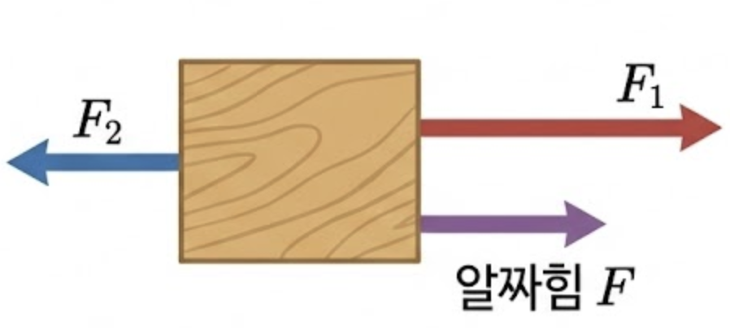

# 힘이란 무엇인가?
힘(Force)은 `물체의 운동 상태 또는 모양을 변화시키는 작용`을 말한다. (일단 고등학교 과정 물리학에서 모양을 변화시키는 경우는 제외하자.) 아이작 뉴턴이 개념적으로 정립하였으며, 단위도 그의 이름에서 딴 `뉴턴(N)`으로 정의된다.

## 힘의 벡터 표현
힘은 크기와 방향을 모두 갖는 벡터이므로, 한 물체에 작용하는 힘도 벡터의 합으로 표현할 수 있다. 아래 시뮬레이션을 통해서 1차원에서 작용하는 `모든 힘의 합(알짜힘이)`에 대해서 탐구해 보자.

<iframe src="https://phet.colorado.edu/sims/html/forces-and-motion-basics/latest/forces-and-motion-basics_ko.html"
        width="800"
        height="600"
        allowfullscreen>
</iframe>

### 알짜힘이란 무엇인가?
알짜힘은 물체에 작용하는 `모든 힘의 벡터합`이다. 즉, 물체가 받는 순 힘으로, 실제 물체에 작용되는 힘의 크기와 방향을 나타낸다.

`알짜힘이 0이면 물체는 정지 상태 또는 등속 직선 운동`을 한다. `알짜힘이 0이 아니면 물체는 가속 운동`을 하게 된다.

| | |
|:---:|:---:|
|  |  |
| **같은 방향으로 $F_1$과 $F_2$가 작용할 때** | **반대 방향으로 $F_1$과 $F_2$가 작용할 때** |
| $F_{net} = F_1 + F_2$ | $F_{net} = F_1 - F_2$ |
  
  #TODO 아래 뭐또쓸지 생각하기