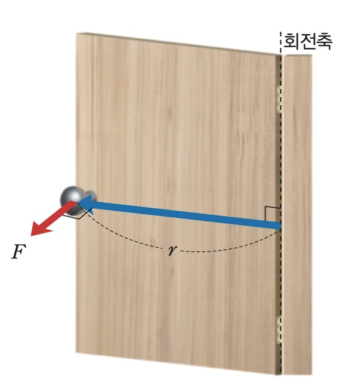

# 돌림힘이란 무엇인가
`돌림힘 또는 토크(torque)` 기호로는 이렇게 쓴다. $\tau$(타우) 돌림힘은 물체가 회전운동을 할 때 나타나는 회전의 경향의 척도, 물체를 회전시키기 위해 가한 힘의 작용을 나타낸다.

힘은 물체의 운동 상태의 변화를 만드는 물리량이었다면 돌림힘은 물체의 회전 운동상태의 변화를 만드는 물리량이다.

## 일상생활에 숨어있는 돌림힘

문 손잡이를 생각해보자. 손잡이에 힘을 가하면 문은 경첩을 중심으로 회전한다. 이때 회전을 일으키는 원인이 바로 '돌림힘(토크)'이다.
`돌힘은 힘의 크기뿐만 아니라 회전축으로부터의 거리에도 비례`한다. 문을 열 때 손잡이 부분을 미는 것이 경첩 가까이를 미는 것보다 훨씬 쉬운 이유가 여기에 있다. `같은 힘을 주더라도 회전축에서 멀수록 더 큰 돌림힘이 발생하기 때문이다.`

  

  
더 큰 돌림힘이 작용해 문을 돌리기 쉽다.

  

  

  
상대적으로 작은 돌림힘이 작용해 문을 돌리기 어렵다.

  

## 돌림힘의 수학적 표현

돌림힘은 힘벡터와 회전축까지의 거리벡터의 벡터곱이다. 즉, 식으로 표현하면 다음과 같다.

$$
\mathbf{\tau} = \mathbf{r} \times \mathbf{F} \quad [N \cdot m]
$$

여기서 **$\mathbf{F}$** 는 가한 힘, **$\mathbf{r}$** 는 회전축까지의 거리(모멘트 팔)다.

## 모멘트 팔

돌림힘을 이해하는 데 중요한 개념이 바로 **모멘트 팔(moment arm)** 이다. 모멘트 팔은 회전축에서 힘의 작용선까지의 수직 거리를 말한다.

힘이 회전축에 대해 수직으로 작용하면 모멘트 팔은 단순히 회전축까지의 거리 $r$이 된다. 하지만 힘이 비스듬히 작용하면 어떻게 될까?

$$
\tau = rF\sin\theta
$$

여기서 $\theta$는 거리 벡터 $\mathbf{r}$과 힘 벡터 $\mathbf{F}$ 사이의 각도다.

힘이 비스듬히 작용할 때, 실제로 회전에 기여하는 것은 힘의 수직 성분뿐이다.

이것이 바로 문을 밀 때 문에 수직으로 미는 것이 가장 효율적인 이유다. $\theta = 90°$일 때 $\sin\theta = 1$로 최대가 되기 때문이다.

## 돌림힘의 방향: 오른손 법칙

돌림힘은 벡터량이므로 크기뿐만 아니라 방향도 갖는다. 돌림힘의 방향은 **오른손 법칙**으로 결정한다.
1. 오른손 네 손가락을 $\mathbf{r}$ 방향으로 펴고
2. $\mathbf{F}$ 방향으로 손가락을 감아쥔다
3. 이때 엄지손가락이 가리키는 방향이 돌림힘 $\boldsymbol{\tau}$의 방향이다
관례적으로:
- **반시계 방향** 회전을 일으키는 돌림힘: **양(+)의 방향** (종이에서 나오는 방향)
- **시계 방향** 회전을 일으키는 돌림힘: **음(-)의 방향** (종이로 들어가는 방향)

### 스패너
볼트를 조이거나 풀 때 긴 스패너를 사용하면 더 쉽다. 손잡이가 길수록 회전축(볼트)에서 멀어지므로 같은 힘으로도 더 큰 돌림힘이 발생한다. 자동차 타이어를 교체할 때 십자 렌치의 팔이 긴 이유가 바로 이것이다.

### 자전거 페달
자전거를 탈 때 페달이 가장 아래로 내려가는 순간(수평 위치)에 가장 효율적으로 힘을 전달할 수 있다. 이 위치에서 다리의 힘이 크랭크 축에 대해 수직으로 작용하기 때문이다.

### 병뚜껑 따개
병뚜껑을 손으로 열기 어려울 때 고무 패드나 오프너를 사용하면 쉽게 열린다. 손잡이가 병뚜껑보다 크기 때문에 더 큰 돌림힘을 만들 수 있다.
