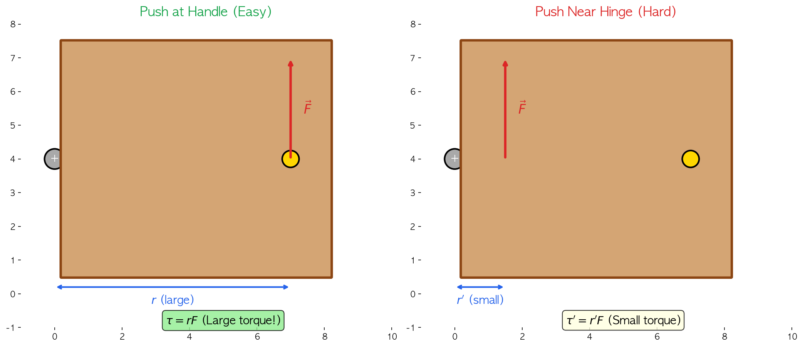
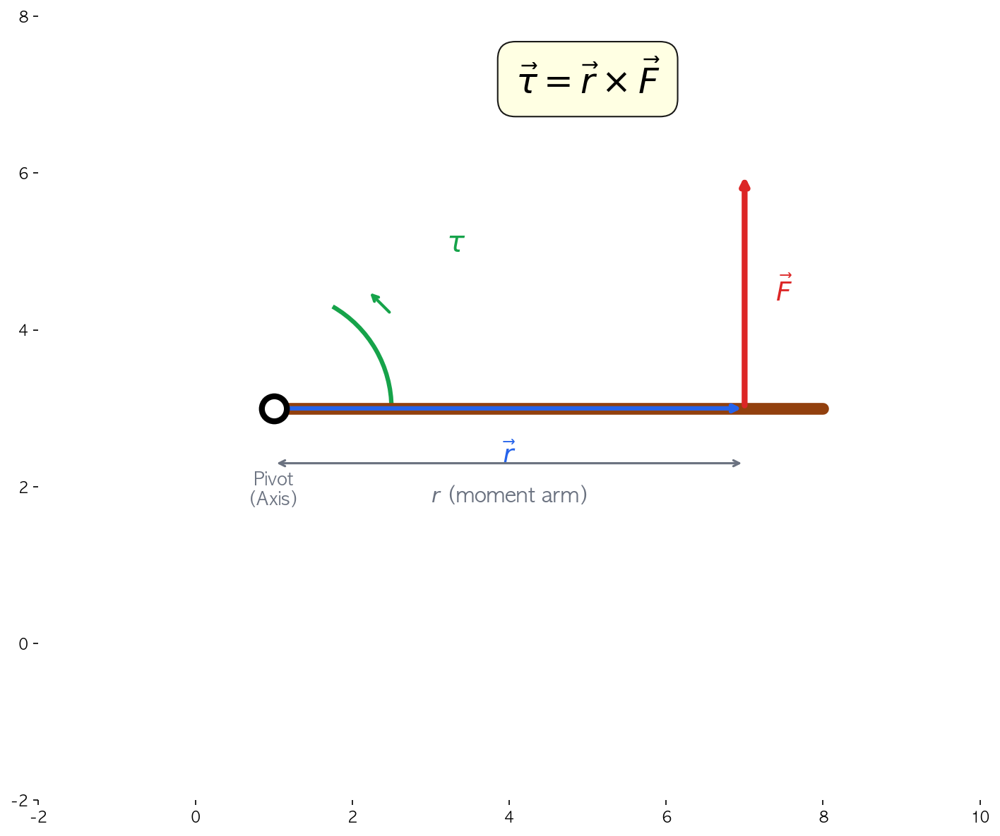
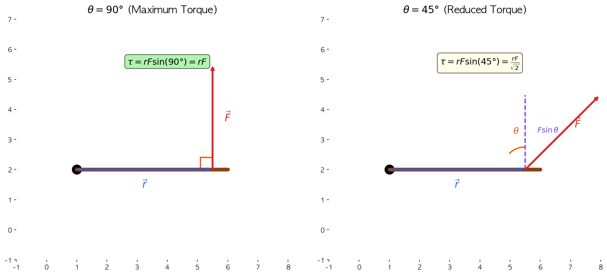
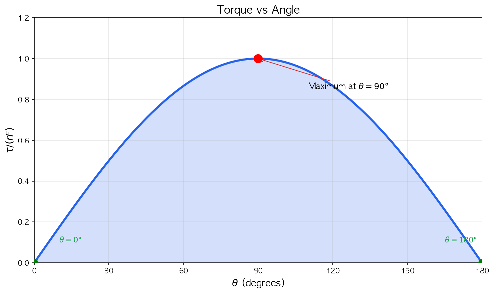
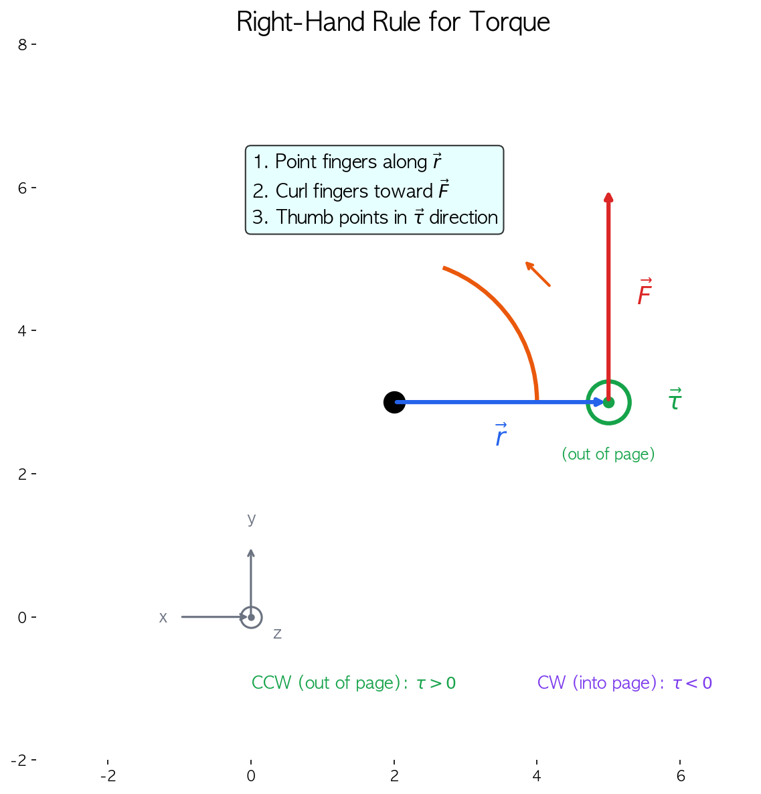
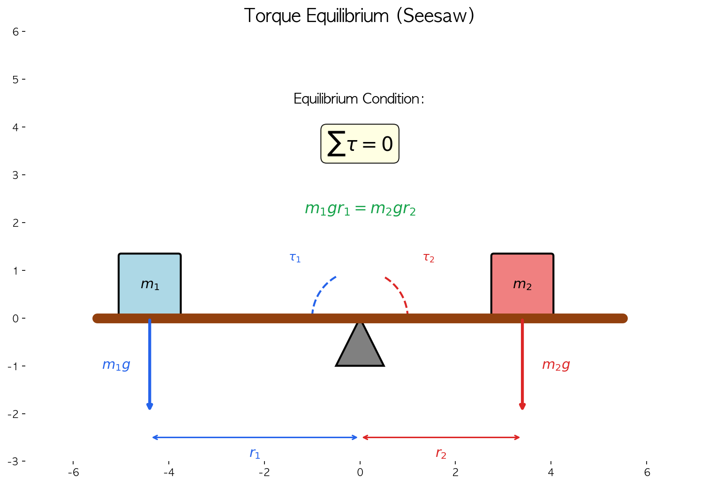
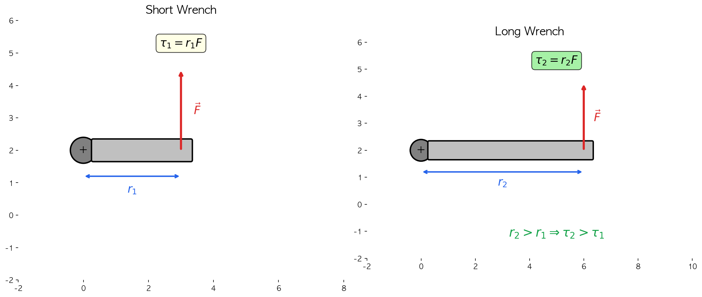
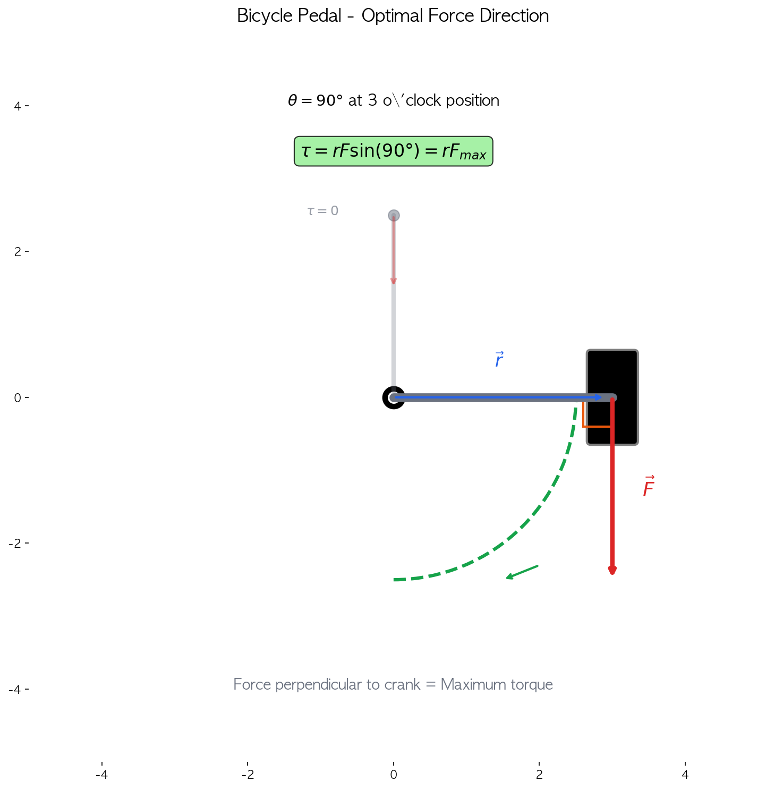

<iframe src="https://www.geogebra.org/classic/pgv9h7yw?embed" width="800" height="600" allowfullscreen style="border: 1px solid #e4e4e4;border-radius: 4px;" frameborder="0"></iframe>
# 돌림힘이란 무엇인가

`돌림힘 또는 토크(torque)`는 기호로 $\tau$(타우)를 사용한다. 돌림힘은 **물체가 회전운동을 할 때 나타나는 회전의 경향의 척도**로, 물체를 회전시키기 위해 가한 힘의 효과를 나타낸다.

직선 운동에서 힘($\vec{F}$)이 물체의 운동 상태 변화를 만드는 물리량이라면, **돌림힘($\vec{\tau}$)은 물체의 회전 운동 상태 변화를 만드는 물리량**이다. 이 관계는 아래 표와 같이 대응된다.

| 직선 운동 | 회전 운동 |
|:---:|:---:|
| 힘 $\vec{F}$ | 돌림힘 $\vec{\tau}$ |
| 질량 $m$ | 관성 모멘트 $I$ |
| 가속도 $\vec{a}$ | 각가속도 $\vec{\alpha}$ |
| $\vec{F} = m\vec{a}$ | $\vec{\tau} = I\vec{\alpha}$ |

---

## 일상생활에 숨어있는 돌림힘

문 손잡이를 생각해보자. 손잡이에 힘을 가하면 문은 경첩을 중심으로 회전한다. 이때 회전을 일으키는 원인이 바로 '돌림힘(토크)'이다.

`돌림힘은 힘의 크기뿐만 아니라 회전축으로부터의 거리에도 비례`한다. 문을 열 때 손잡이 부분을 미는 것이 경첩 가까이를 미는 것보다 훨씬 쉬운 이유가 여기에 있다. `같은 힘을 주더라도 회전축에서 멀수록 더 큰 돌림힘이 발생하기 때문이다.`

왼쪽 그림처럼 손잡이 부분(회전축에서 먼 곳)을 밀면 큰 돌림힘이 발생하여 문을 쉽게 열 수 있다. 반면 오른쪽 그림처럼 경첩 근처(회전축에 가까운 곳)를 밀면 같은 힘으로도 훨씬 작은 돌림힘만 발생하여 문을 열기 어렵다.

---

## 돌림힘의 수학적 표현

돌림힘은 **힘 벡터와 회전축까지의 위치 벡터의 벡터곱(외적)**으로 정의된다.

$$
\vec{\tau} = \vec{r} \times \vec{F} \quad [\mathrm{N \cdot m}]
$$

여기서:
- $\vec{F}$: 가한 힘 벡터
- $\vec{r}$: 회전축에서 힘의 작용점까지의 위치 벡터 (모멘트 팔)
- $\vec{\tau}$: 돌림힘 벡터

돌림힘의 **크기**는 다음과 같이 표현된다:

$$
|\vec{\tau}| = |\vec{r}||\vec{F}|\sin\theta = rF\sin\theta
$$

여기서 $\theta$는 $\vec{r}$과 $\vec{F}$ 사이의 각도이다.

> **💡 핵심 포인트**
> - 돌림힘의 단위는 $\mathrm{N \cdot m}$ (뉴턴미터)이다.
> - 에너지의 단위 $\mathrm{J}$ (줄)과 차원은 같지만, 물리적 의미가 다르므로 구분하여 사용한다.

---

## 모멘트 팔 (Moment Arm)

돌림힘을 이해하는 데 중요한 개념이 바로 **모멘트 팔(moment arm)**이다. 모멘트 팔은 **회전축에서 힘의 작용선까지의 수직 거리**를 말한다.

힘이 회전축에 대해 **수직으로** 작용하면 모멘트 팔은 단순히 회전축까지의 거리 $r$이 된다. 하지만 힘이 **비스듬히** 작용하면 어떻게 될까?

$$
\tau = rF\sin\theta
$$

| 각도 $\theta$ | $\sin\theta$ | 돌림힘 |
|:---:|:---:|:---:|
| $0°$ | $0$ | $\tau = 0$ (회전 없음) |
| $30°$ | $0.5$ | $\tau = 0.5rF$ |
| $45°$ | $\frac{\sqrt{2}}{2} \approx 0.71$ | $\tau \approx 0.71rF$ |
| $90°$ | $1$ | $\tau = rF$ (최대) |

### 각도에 따른 돌림힘 변화

그래프에서 알 수 있듯이, **$\theta = 90°$일 때 돌림힘이 최대**가 된다. 이것이 바로 문을 밀 때 문에 **수직으로** 미는 것이 가장 효율적인 이유다!

---
### 📝 형성평가(꼭 풀어보세요)

**문제 1.** 길이가 0.5 m인 렌치의 끝에 100 N의 힘을 수직으로 가했다. 돌림힘의 크기는?

정답 보기

$$\tau = rF\sin\theta = 0.5 \times 100 \times \sin 90° = 50 \, \mathrm{N \cdot m}$$

---

**문제 2.** 위와 같은 상황에서 힘을 45° 각도로 비스듬히 가했다면 돌림힘은?

정답 보기

$$\tau = rF\sin\theta = 0.5 \times 100 \times \sin 45° = 50 \times \frac{\sqrt{2}}{2} \approx 35.4 \, \mathrm{N \cdot m}$$

수직으로 힘을 가할 때보다 약 70%의 효율만 발생한다.

---

**문제 3.** 돌림힘을 최대로 하기 위한 조건 두 가지를 쓰시오.

정답 보기

1. 회전축에서 힘의 작용점까지의 거리($r$)를 최대로 한다.
2. 힘의 방향이 위치 벡터에 수직($\theta = 90°$)이 되도록 한다.

---

## 돌림힘의 방향: 오른손 법칙

돌림힘은 **벡터량**이므로 크기뿐만 아니라 **방향**도 갖는다. 돌림힘의 방향은 **오른손 법칙**으로 결정한다.

### 오른손 법칙 사용법

1. 오른손 네 손가락을 $\vec{r}$ 방향으로 편다
2. $\vec{F}$ 방향으로 손가락을 감아쥔다
3. 이때 **엄지손가락이 가리키는 방향**이 돌림힘 $\vec{\tau}$의 방향이다

### 부호 규약

2차원 평면에서 회전을 다룰 때는 다음과 같은 부호 규약을 사용한다:

| 회전 방향 | 돌림힘 방향 | 부호 |
|:---:|:---:|:---:|
| **반시계 방향 (CCW)** | 종이에서 나오는 방향 | **양(+)** |
| **시계 방향 (CW)** | 종이로 들어가는 방향 | **음(-)** |

---

## 돌림힘의 평형: 시소의 원리

물체가 회전하지 않고 평형 상태를 유지하려면, 물체에 작용하는 **모든 돌림힘의 합이 0**이어야 한다.

$$
\sum \tau = 0
$$

이것을 **돌림힘의 평형 조건** 또는 **회전 평형**이라고 한다.

시소가 평형을 이루려면:

$$
\tau_1 = \tau_2
$$

$$
m_1 g r_1 = m_2 g r_2
$$

$$
m_1 r_1 = m_2 r_2
$$

> **💡 시소의 원리**
> - 무거운 사람은 받침점에 가까이, 가벼운 사람은 받침점에서 멀리 앉아야 균형이 맞는다.
> - 이 원리는 **지렛대의 원리**와 같다.

---
### 📝 형성평가(꼭 풀어보세요)

**문제 4.** 질량이 60 kg인 사람이 시소의 받침점에서 2 m 떨어진 곳에 앉아 있다. 질량이 40 kg인 사람이 균형을 맞추려면 받침점에서 얼마나 떨어진 곳에 앉아야 하는가?

정답 보기

돌림힘 평형 조건에서:
$$m_1 r_1 = m_2 r_2$$
$$60 \times 2 = 40 \times r_2$$
$$r_2 = \frac{120}{40} = 3 \, \mathrm{m}$$

40 kg인 사람은 받침점에서 **3 m** 떨어진 곳에 앉아야 한다.

---

**문제 5.** 길이 4 m인 균일한 막대(질량 10 kg)가 한쪽 끝에서 1 m 떨어진 지점을 받침점으로 하여 수평으로 평형을 이루고 있다. 막대의 짧은 쪽 끝에 매달아야 할 추의 질량은? (막대의 질량 중심은 막대의 중앙에 있다.)

정답 보기

- 막대의 질량 중심: 받침점에서 오른쪽으로 1 m (막대 중앙)
- 막대의 무게에 의한 돌림힘: $10g \times 1 = 10g$ (시계 방향)
- 추의 무게에 의한 돌림힘: $Mg \times 1$ (반시계 방향)

평형 조건:
$$M \times 1 = 10 \times 1$$
$$M = 10 \, \mathrm{kg}$$

---

## 일상생활 속 돌림힘의 응용

### 1. 스패너(렌치)

볼트를 조이거나 풀 때 **긴 스패너**를 사용하면 더 쉽다. 손잡이가 길수록 회전축(볼트)에서 멀어지므로 같은 힘으로도 더 큰 돌림힘이 발생한다.

자동차 타이어를 교체할 때 **십자 렌치의 팔이 긴 이유**가 바로 이것이다. 또한 렌치 끝에 파이프를 끼워서 팔을 연장하면 더 쉽게 볼트를 풀 수 있다.

### 2. 자전거 페달

자전거를 탈 때 **페달이 수평 위치에 있을 때** 가장 효율적으로 힘을 전달할 수 있다. 이 위치에서 다리의 힘이 크랭크 축에 대해 **수직으로** 작용하기 때문이다.

페달이 최상단(12시)이나 최하단(6시)에 있을 때는 $\theta = 0°$가 되어 돌림힘이 0이 된다. 따라서 이 위치에서는 아무리 힘을 세게 밟아도 회전에 기여하지 못한다.

### 3. 병뚜껑 따개

병뚜껑을 손으로 열기 어려울 때 고무 패드나 오프너를 사용하면 쉽게 열린다. 손잡이가 병뚜껑보다 크기 때문에 **더 큰 모멘트 팔**을 확보하여 더 큰 돌림힘을 만들 수 있다.

### 4. 문 손잡이의 위치

문 손잡이가 항상 경첩의 반대쪽 끝에 있는 이유도 돌림힘 때문이다. 회전축에서 최대한 멀리 떨어진 곳에 힘을 가해야 **적은 힘으로도 큰 돌림힘**을 만들 수 있기 때문이다.

---

<strong>📝 형성평가 3</strong>

**문제 6.** 다음 중 돌림힘에 대한 설명으로 옳은 것을 모두 고르시오.

① 돌림힘의 단위는 J(줄)이다.  
② 힘의 크기가 같아도 모멘트 팔이 길수록 돌림힘이 크다.  
③ 힘이 회전축을 향하면 돌림힘은 0이다.  
④ 돌림힘은 스칼라량이다.  
⑤ 반시계 방향 회전을 일으키는 돌림힘을 양(+)으로 정한다.

정답 보기

**②, ③, ⑤**

- ① 틀림: 돌림힘의 단위는 N·m이다. J과 차원은 같지만 물리적 의미가 다르다.
- ② 맞음: $\tau = rF\sin\theta$에서 $r$이 클수록 $\tau$가 크다.
- ③ 맞음: 힘이 회전축을 향하면 $\theta = 0°$이므로 $\sin\theta = 0$, 따라서 $\tau = 0$
- ④ 틀림: 돌림힘은 벡터량이다.
- ⑤ 맞음: 오른손 법칙에 의한 관례적 부호 규약이다.

---

**문제 7.** 자동차 타이어를 교체할 때, 너트를 풀기 위해 50 cm 길이의 렌치를 사용했더니 200 N의 힘이 필요했다. 만약 75 cm 길이의 렌치를 사용한다면 같은 돌림힘을 얻기 위해 필요한 힘은?

정답 보기

필요한 돌림힘: $\tau = 0.5 \times 200 = 100 \, \mathrm{N \cdot m}$

새로운 렌치로 같은 돌림힘을 얻으려면:
$$100 = 0.75 \times F$$
$$F = \frac{100}{0.75} = 133.3 \, \mathrm{N}$$

약 **133 N**의 힘만 필요하다. (약 67%로 줄어듦)

---

## 핵심 정리

> **돌림힘의 핵심 개념**
> 
> 1. **정의**: $\vec{\tau} = \vec{r} \times \vec{F}$, 크기: $\tau = rF\sin\theta$
> 
> 2. **단위**: N·m (뉴턴미터)
> 
> 3. **최대 조건**: 힘이 모멘트 팔에 수직일 때 ($\theta = 90°$)
> 
> 4. **방향**: 오른손 법칙으로 결정 (CCW: +, CW: -)
> 
> 5. **평형 조건**: $\sum \tau = 0$
> 
> 6. **응용**: 지렛대, 렌치, 자전거 페달, 문 손잡이 등

---

## 다음 학습 내용

다음 포스트에서는 **회전하는 물체의 관성**을 나타내는 **관성 모멘트(Moment of Inertia)**와 **각운동량(Angular Momentum)**에 대해 알아보자. 이 개념들을 통해 회전 운동의 뉴턴 제2법칙인 $\vec{\tau} = I\vec{\alpha}$를 완전히 이해할 수 있을 것이다.