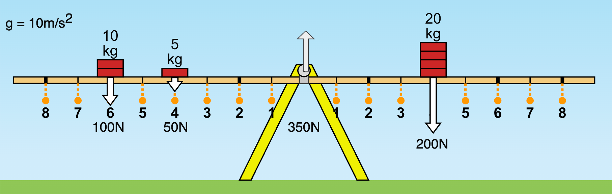
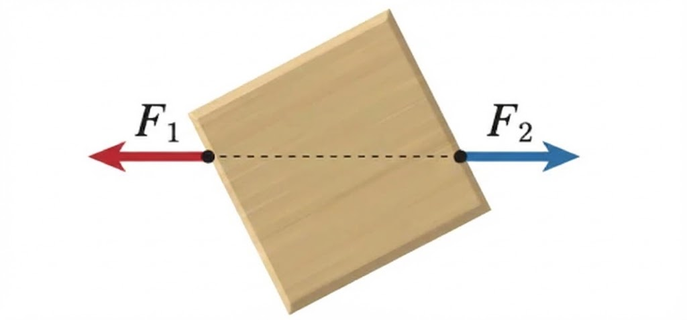

# 평형과 안정성: 왜 우리는 넘어지지 않을까?

## 서 있는 것의 물리학
아침에 눈을 뜨고 침대에서 일어나 서는 순간, 우리는 이미 복잡한 물리학적 과제를 수행하고 있다. 두 발로 서서 균형을 잡고, 걸어서 화장실로 이동하고, 한 발로 서서 양말을 신는다. 이 모든 동작이 가능한 이유는 우리 몸이 무의식적으로 `'평형'`이라는 물리 법칙을 따르고 있기 때문이다.

물리학에서 평형이란 물체에 작용하는 `모든 힘의 합(알짜힘)`이 **0이고**, 동시에 모든 `돌림힘`의 합도 **0인** 상태를 말한다. 쉽게 말해, 밀리지도 않고 회전하지도 않는 상태다.

## 물체의 평형조건
알짜힘이 0이라고 해서 물체가 항상 정지해 있는 것은 아니다. 아래 그림을 참고해보자. 양쪽으로 당기는 힘은 50N으로 크기가 동일하다고 가정하자, 상자는 어떻게 움직일까요? 여러분도 실제로 종이를 당겨보고 어떻게 움직이는지 관찰해보세요.
(회전하다가 양쪽으로 당기는 힘의 작용점 높이가 같아질때 멈출 것이다.)

## 평형의 두 조건

물체가 완전한 평형 상태에 있으려면 두 가지 조건이 동시에 만족되어야 한다.

:::important
1. **모든 힘의 합이 0이어야 한다(병진 평형).**
2. **모든 돌림힘의 합이 0이어야 한다(회전 평형).**
:::

시소를 예로 들어보자. 무거운 아이와 가벼운 아이가 시소에 탔을 때, 두 아이가 받침점으로부터 같은 거리에 앉으면 시소는 무거운 쪽으로 기울어진다. 하지만 가벼운 아이가 더 멀리 앉으면? 작은 힘이라도 긴 팔 길이를 통해 더 큰 돌림힘이 만들어내어 균형을 맞출 수 있다.

## 안정성: 다 같은 평형상태가 아니다.
모든 평형이 같은 것은 아니다. 물리학에서는 평형의 '안정성'을 세 가지로 구분한다.
안정 평형은 물체를 살짝 밀었을 때 원래 위치로 돌아오는 경우다. 그릇 바닥에 놓인 구슬을 생각해보자. 옆으로 밀어도 결국 가장 낮은 곳으로 굴러 돌아온다.
불안정 평형은 조금만 건드려도 평형이 깨지는 경우다. 볼록한 언덕 꼭대기에 올려놓은 구슬은 아주 작은 충격에도 굴러 떨어진다.
중립 평형은 어디에 두어도 그 상태를 유지하는 경우다. 평평한 바닥 위의 구슬은 밀어서 이동시킨 후에도 새로운 위치에서 정지해 있다.

#TODO 세 가지 평형 상태를 비교하는 그림. (1) 오목한 그릇 안의 구슬(안정 평형), (2) 볼록한 언덕 위의 구슬(불안정 평형), (3) 평평한 면 위의 구슬(중립 평형). 각각의 구슬을 살짝 밀었을 때의 운동 방향을 화살표로 표시.

## 무게중심과 받침면
건물이 무너지지 않고, 자동차가 커브길에서 전복되지 않는 이유는 무엇일까? 그 비밀은 '무게중심'과 '지지면'의 관계에 있다.
무게중심이란 물체의 무게가 집중되어 있다고 볼 수 있는 점이다. 지지면은 물체가 바닥과 접촉하는 영역을 말한다. 핵심 원리는 간단하다: 무게중심에서 수직으로 내린 선이 지지면 안에 있으면 물체는 넘어지지 않는다.
이것이 바로 짐을 잔뜩 실은 트럭이 급커브에서 전복되기 쉬운 이유다. 무게중심이 높아지면 조금만 기울어져도 무게중심의 수직선이 지지면 밖으로 벗어나기 때문이다. 반대로 스포츠카는 무게중심을 최대한 낮추어 고속 코너링에서도 안정성을 유지한다.

#TODO 무게중심과 지지면의 관계를 보여주는 그림. (1) 바로 선 박스: 무게중심에서 내린 수직선이 지지면 안에 있음. (2) 기울어진 박스: 수직선이 지지면 경계에 근접. (3) 더 기울어진 박스: 수직선이 지지면 밖으로 벗어나 넘어지는 순간.

## 구조물 설계의 물리학

현대 건축과 토목공학에서 평형과 안정성은 핵심 원리다. 다리를 설계할 때 엔지니어들은 모든 기둥과 케이블에 작용하는 힘을 계산하여 어느 한 부분도 과도한 힘을 받지 않도록 한다.
현수교는 특히 좋은 예시다. 케이블의 장력, 교각이 받는 압축력, 다리 상판의 무게가 정교하게 균형을 이루어야 한다. 단 하나의 케이블이라도 과도한 장력을 받으면 구조 전체가 위험해질 수 있다.
지진에 대비한 건물 설계에서도 안정성은 중요하다. 지진이 발생하면 건물에 수평 방향의 힘이 가해지는데, 이때 건물이 평형을 유지하려면 적절한 구조적 대응이 필요하다. 많은 현대 건물이 내진 설계를 통해 지진의 충격을 흡수하고 분산시키는 것도 이러한 원리에 기반한다.

## 예제 풀어보기