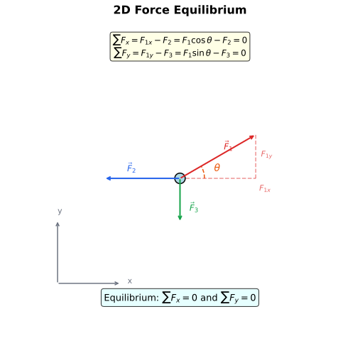
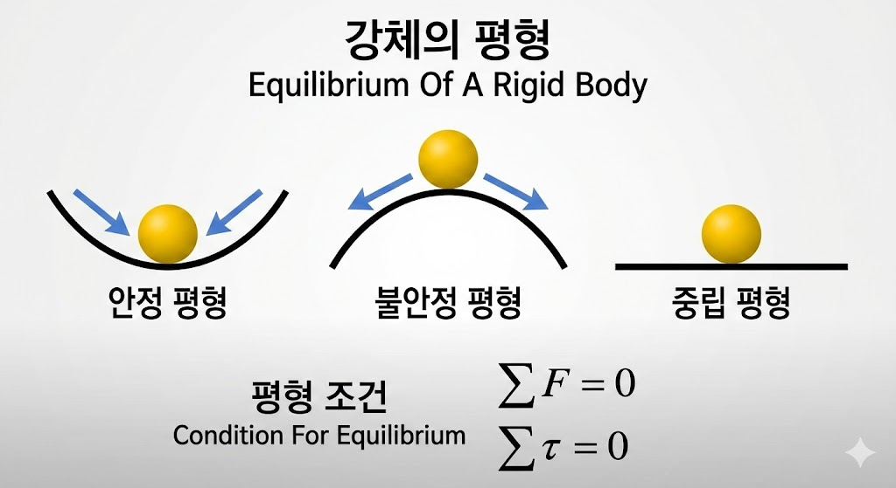
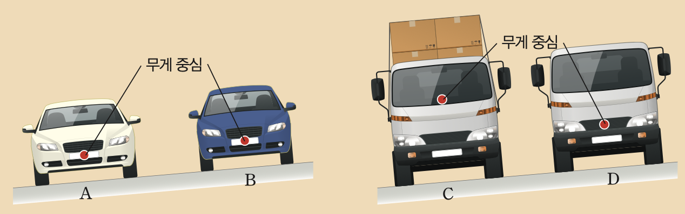

# 평형과 안정성: 왜 우리는 넘어지지 않을까?

아침에 눈을 뜨고 침대에서 일어나 서는 순간, 우리는 이미 복잡한 물리학적 과제를 수행하고 있다. 두 발로 서서 균형을 잡고, 걸어서 화장실로 이동하고, 한 발로 서서 양말을 신는다. 이 모든 동작이 가능한 이유는 우리 몸이 무의식적으로 `평형`이라는 물리 법칙을 따르고 있기 때문이다.

그렇다면 물체가 균형을 유지하려면 어떤 조건이 필요할까? 그리고 같은 평형 상태라도 왜 어떤 물체는 쉽게 넘어지고, 어떤 물체는 안정적으로 서 있을까?

## 학습 목표

> - 힘의 평형과 돌림힘의 평형 조건을 설명할 수 있다.
> - 안정 평형, 불안정 평형, 중립 평형의 차이를 구분할 수 있다.
> - 무게중심과 지지면의 관계로 물체의 안정성을 분석할 수 있다.

---

## 1. 평형이란?

물리학에서 `평형(Equilibrium)`이란 물체의 운동 상태가 변하지 않는 상태를 말한다. 정지해 있는 물체가 계속 정지해 있거나, 등속 운동하는 물체가 계속 등속 운동을 유지하는 것이다.

:::important[평형의 정의]
물체에 작용하는 **알짜힘이 0**이고, **알짜 돌림힘도 0**인 상태
:::

평형 상태의 물체는 병진 운동(직선 운동)도 하지 않고, 회전 운동도 하지 않는다.

---

## 2. 힘의 평형 (병진 평형)

물체가 직선 방향으로 움직이지 않으려면, 물체에 작용하는 모든 힘의 합이 0이어야 한다.

$$
\sum \vec{F} = 0
$$

이를 `병진 평형` 또는 `힘의 평형`이라고 한다.

  

  
  
  

### 2차원에서의 힘의 평형

2차원 평면에서 힘의 평형 조건은 x, y 방향으로 각각 성립해야 한다.

$$
\sum F_x = 0 \quad \text{그리고} \quad \sum F_y = 0
$$

  

  
  
  

---

## 3. 돌림힘의 평형 (회전 평형)

알짜힘이 0이라고 해서 물체가 항상 정지해 있는 것은 아니다. 아래 그림을 보자.

  

  

  

  

  

  

두 경우 모두 알짜힘은 0이다. 하지만 왼쪽은 회전하고, 오른쪽은 회전하지 않는다. 차이는 `돌림힘`에 있다.

물체가 회전하지 않으려면, 물체에 작용하는 모든 돌림힘의 합이 0이어야 한다.

$$
\sum \tau = 0
$$

이를 `회전 평형` 또는 `돌림힘의 평형`이라고 한다.

---

## 4. 평형의 두 조건

물체가 완전한 평형 상태에 있으려면 **두 가지 조건이 동시에** 만족되어야 한다.

:::important[평형의 두 조건]
1. **병진 평형**: $\sum \vec{F} = 0$ (알짜힘 = 0)
2. **회전 평형**: $\sum \tau = 0$ (알짜 돌림힘 = 0)
:::

### 시소의 예

시소가 수평으로 균형을 이루려면:

  

  
  

**병진 평형**: 받침점의 수직항력이 양쪽의 벽돌의 무게를 지탱
아래 방향을 -방향, 위 방향을 +방향으로 놓으면 아래와 같이 병진 평형식을 쓸 수 있다.
$$
N + m_1 g + m_2 g + m_3 g = 0 \\[10pt]
N = 100N + 50N + 200N = 350N \\
$$

**회전 평형**: 세 뭉탱이 벽돌이 만드는 돌림힘의 크기가 합이 0이어야함.

:::important[돌림힘의 부호]
- 종이면으로 들어가는 방향 돌림힘은 **- 부호**
- 종이면으로 나오는 방향 돌림힘은 **+ 부호**
:::
왼쪽에 있는 벽돌이 만드는 돌림힘 부터 차례대로 $\tau_1, \tau_2, \tau_3$로 표시한다.
$$

\tau_1 + \tau_2 + \tau_3 = 0 \\[10pt]
6 \times 100 + 4 \times 50 - 4 \times 200 = 0 \\
$$

$$
\therefore \quad \sum \tau = 0
$$

이므로 시소는 `병진`, `돌림힘` 두가지 `모두 평형`을 만족하므로 평형상태에 있을 것이다.

:::tip[시소의 원리]
무거운 사람은 받침점에 **가까이**, 가벼운 사람은 받침점에서 **멀리** 앉아야 균형이 맞는다. 이것이 바로 **지렛대의 원리**다!
:::

---

## 5. 안정성: 모든 평형이 같지 않다

같은 평형 상태라도 `안정성`은 다를 수 있다. 물체를 살짝 건드렸을 때 어떻게 반응하는지에 따라 세 가지로 구분한다.

  

  
  

### 안정 평형 (Stable Equilibrium)

물체를 살짝 밀었을 때 **원래 위치로 돌아오는** 경우다.

:::note[안정 평형]

- 오목한 그릇(또는 골짜기 모양 곡면) 안의 구슬
- 구슬을 옆으로 밀었을 때 다시 중앙으로 돌아오는 화살표
- 위치에너지 그래프: U자 모양, 최저점에 구슬 위치
- **예시**: 그릇 바닥의 구슬, 흔들의자
-**특징**: 위치에너지가 **최소**인 상태
:::

### 불안정 평형 (Unstable Equilibrium)

물체를 살짝 건드리면 **평형에서 멀어지는** 경우다.

:::note[불안정 평형]
- 볼록한 언덕 꼭대기에 놓인 구슬
- 구슬을 살짝 밀면 굴러 떨어지는 화살표
- 위치에너지 그래프: 역U자 모양(∩), 최고점에 구슬 위치
- **예시**: 언덕 꼭대기의 공, 뾰족한 끝에 세운 연필
- **특징**: 위치에너지가 **최대**인 상태
:::

### 중립 평형 (Neutral Equilibrium)

물체를 밀어도 **새로운 위치에서 평형을 유지**하는 경우다.

:::note[중립 평형]
- 평평한 수평면 위의 구슬
- 구슬을 밀면 이동 후 그 자리에서 정지
- 위치에너지 그래프: 수평선
- **예시**: 평면 위의 공, 수평 막대 위를 구르는 원통
- **특징**: 위치에너지가 **일정**한 상태
:::

### 세 가지 평형 비교

| 평형 종류 | 건드렸을 때 | 위치에너지 | 예시 |
|:---:|:---:|:---:|:---|
| 안정 평형 | 원래로 돌아옴 | 최소 | 그릇 속 구슬 |
| 불안정 평형 | 멀어짐 | 최대 | 언덕 위 공 |
| 중립 평형 | 새 위치에서 정지 | 일정 | 평면 위 공 |

---

## 6. 무게중심과 받침면

건물이 무너지지 않고, 자동차가 커브길에서 전복되지 않는 이유는 무엇일까? 그 비밀은 `무게중심`과 `받침면`의 관계에 있다.

### 무게중심 (Center of Gravity)

물체의 무게가 집중되어 있다고 볼 수 있는 점이다. 균일한 물체에서는 기하학적 중심과 일치한다.

### 받침면 (Base of Support)

물체가 바닥과 접촉하는 영역을 말한다. 네 발 달린 의자라면 네 발끝을 연결한 사각형이 지지면이다.

### 안정성 조건

:::important[넘어지지 않는 조건]
**무게중심에서 수직으로 내린 선이 받침면 안에 있으면** 물체는 넘어지지 않는다.
:::

  

  
  출처: 최혁준 외, [고등학교 물리학], 천재 교과서 27쪽
  

### 안정성을 높이는 방법

1. **무게중심을 낮춘다** → 기울어져도 수직선이 지지면을 벗어나기 어려움
2. **받침면을 넓힌다** → 수직선이 지지면 안에 머무를 확률 증가

:::tip[실생활 예시]
- **스포츠카**: 무게중심을 낮춰 고속 코너링에서도 전복 방지
- **짐 실은 트럭**: 무게중심이 높아져 급커브에서 전복 위험 증가
- **피사의 사탑**: 기울어져도 무게중심 수직선이 지지면 안에 있어서 안 넘어짐
:::

---

## 7. 일상생활 속 평형과 안정성

### 줄타기

줄타기 곡예사가 긴 막대를 드는 이유는 **관성 모멘트를 증가**시켜 균형을 잡기 쉽게 하기 위해서다. 또한 막대가 아래로 휘어지면 **무게중심이 낮아져** 더 안정적이 된다.

### 내진 설계

지진이 발생하면 건물에 수평 방향의 힘이 가해진다. 건물이 평형을 유지하려면 이 힘에 대응하는 구조가 필요하다. 현대 건물의 **내진 설계**는 충격을 흡수하고 분산시켜 평형을 유지한다.

### 이층 버스와 저상 버스

이층 버스는 무게중심이 높아 커브길에서 불안정하다. 반면 저상 버스는 무게중심이 낮아 훨씬 안정적이다.

---

## 8. 형성평가

### 📝 문제 1

다음 중 평형 상태에 대한 설명으로 옳은 것을 모두 고르시오.

① 알짜힘이 0이면 반드시 평형 상태이다.  
② 평형 상태인 물체는 반드시 정지해 있다.  
③ 알짜 돌림힘이 0이면 물체는 회전하지 않는다.  
④ 완전한 평형을 위해서는 알짜힘과 알짜 돌림힘이 모두 0이어야 한다.  
⑤ 등속 직선 운동하는 물체도 평형 상태일 수 있다.

정답 확인

**③, ④, ⑤**

- ① 틀림: 알짜힘이 0이어도 알짜 돌림힘이 0이 아니면 회전함
- ② 틀림: 등속 직선 운동도 평형 상태
- ③ 맞음: 회전 평형 조건
- ④ 맞음: 평형의 두 조건
- ⑤ 맞음: 속도가 일정하면 가속도가 0이므로 알짜힘 = 0

---

### 📝 문제 2

질량이 60 kg인 사람이 시소의 받침점에서 2 m 떨어진 곳에 앉아 있다. 질량이 40 kg인 사람이 균형을 맞추려면 받침점에서 얼마나 떨어진 곳에 앉아야 하는가?

정답 확인

돌림힘 평형 조건에서:
$$m_1 r_1 = m_2 r_2$$
$$60 \times 2 = 40 \times r_2$$
$$r_2 = \frac{120}{40} = 3 \, \mathrm{m}$$

40 kg인 사람은 받침점에서 **3 m** 떨어진 곳에 앉아야 한다.

---

### 📝 문제 3

다음 상황을 안정 평형, 불안정 평형, 중립 평형으로 분류하시오.

(가) 책상 위에 놓인 지우개  
(나) 손가락 끝에 세운 연필  
(다) 바닥에서 굴러가는 농구공  
(라) 그네가 가장 낮은 점을 지나는 순간

정답 확인

- **(가) 안정 평형**: 살짝 기울여도 원래 위치로 돌아옴
- **(나) 불안정 평형**: 조금만 흔들려도 쓰러짐
- **(다) 중립 평형**: 어디서 멈춰도 그 자리에서 평형 유지
- **(라) 안정 평형**: 그네를 밀어도 최저점으로 돌아오려 함

---

### 📝 문제 4

길이 4 m인 균일한 막대(질량 10 kg)가 왼쪽 끝에서 1 m 떨어진 지점을 받침점으로 하여 수평으로 평형을 이루고 있다. 막대의 왼쪽 끝에 매달아야 할 추의 질량은? (g = 10 m/s², 막대의 질량 중심은 막대의 중앙에 있다.)

정답 확인

막대의 질량 중심은 왼쪽 끝에서 2 m 지점 (막대 중앙)

받침점 기준:
- 추의 돌림힘 (반시계): $M g \times 1$
- 막대의 돌림힘 (시계): $10 g \times 1$

평형 조건:
$$M \times 1 = 10 \times 1$$
$$M = 10 \, \mathrm{kg}$$

---

### 📝 문제 5

높이가 같은 두 원기둥 A, B가 있다. A는 속이 꽉 찬 원기둥이고, B는 아래쪽만 채워진 원기둥이다. 어느 것이 더 안정적인지 설명하시오.

정답 확인

**B가 더 안정적이다.**

- A (균일): 무게중심이 기하학적 중심(높이의 절반)에 있음
- B (아래쪽만 채움): 무게중심이 기하학적 중심보다 **낮음**

무게중심이 낮을수록 기울어져도 무게중심 수직선이 지지면을 벗어나기 어렵다. 따라서 B가 더 안정적이다.

이 원리는 **오뚝이**, **텀블러 컵** 등에 적용된다.

### 📝 문제 6

그림과 같이 자동차 A, B, C, D가 있다. A는 대형 승용차로서 바퀴 사이의 거리가 넓고, B는 소형 승용차로서 바퀴 사이의 거리가
좁다. 무게 중심의 높이는 A와 B가 비슷하다. C는 짐을 많이 실은 트럭으로서 무게 중심의 높이가 높고, D는 같은 트럭이지만 무게
중심의 높이가 낮다. 이 자동차들이 경사면을 운행하게 될 때의 안정성에 대해 토의해 보자.

  

  
  출처: 최혁준 외, [고등학교 물리학], 천재 교과서 28쪽

  

정답 확인

**A가 더 안정적이다.**
A와 B는 무게 중심 높이가 비슷합니다. 차이점은 바퀴 사이 거리입니다.
A는 바퀴 사이가 넓어서 경사면에서 기울어져도 중력의 작용선이 바퀴 사이 안에 머무를 여유가 더 많습니다. 반면 B는 바퀴 사이가 좁아서 조금만 기울어져도 작용선이 바퀴 바깥으로 벗어나기 쉽습니다.
따라서 A가 더 안정적입니다.

**D가 더 안정적이다.**
C와 D는 같은 트럭이라 바퀴 사이 거리가 같습니다. 차이점은 무게 중심 높이입니다.
C는 짐이 많이 실려 있어서 무게 중심이 높습니다. 무게 중심이 높으면 경사면에서 조금만 기울어져도 중력의 작용선이 크게 이동해서 바퀴 바깥으로 쉽게 벗어납니다. D는 무게 중심이 낮아서 기울어져도 작용선의 이동이 작아 바퀴 안에 머무르기 쉽습니다.
따라서 D가 더 안정적입니다.

---

## 핵심 정리

### 평형의 두 조건

| 조건 | 수식 | 의미 |
|:---:|:---:|:---|
| 병진 평형 | $\sum \vec{F} = 0$ | 직선 운동 변화 없음 |
| 회전 평형 | $\sum \tau = 0$ | 회전 운동 변화 없음 |

### 안정성의 세 종류

| 종류 | 건드렸을 때 | 위치에너지 |
|:---:|:---:|:---:|
| 안정 평형 | 복원 | 최소 |
| 불안정 평형 | 이탈 | 최대 |
| 중립 평형 | 유지 | 일정 |

### 핵심 공식

$$
\boxed{\sum \vec{F} = 0 \quad \text{그리고} \quad \sum \tau = 0}
$$

$$
\boxed{m_1 r_1 = m_2 r_2 \quad \text{(시소의 원리)}}
$$

### 안정성 향상 방법

1. **무게중심 낮추기**
2. **지지면 넓히기**